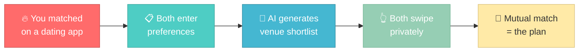
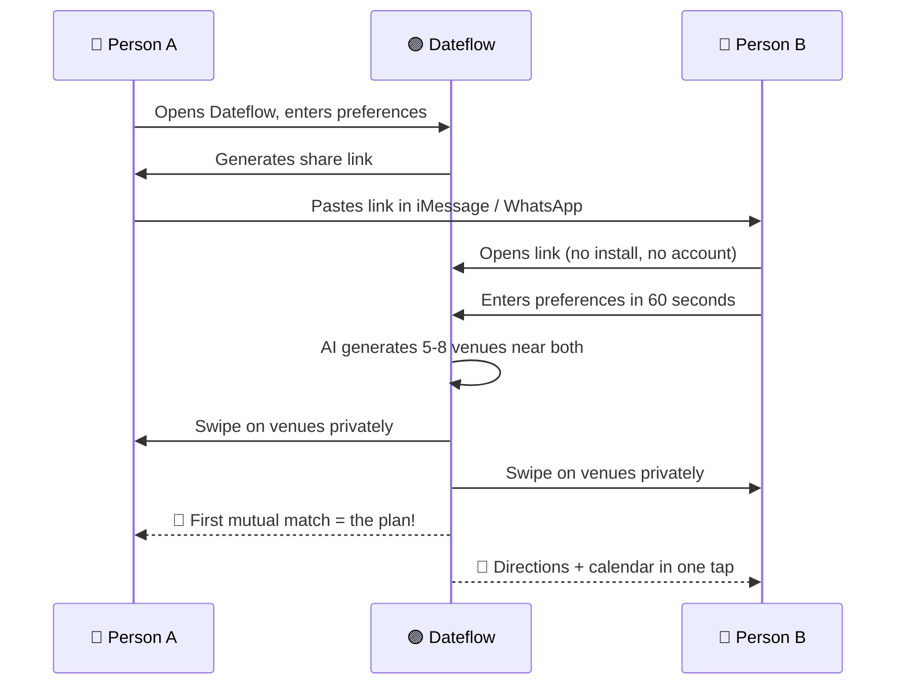
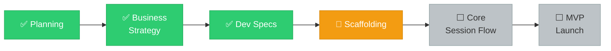

# Dateflow

**AI-powered first date planner.** Two people, one shared shortlist, zero awkward "so what do you want to do?" moments.

Dateflow owns the planning layer that every dating app abandons — the gap between "we matched" and "we have a plan."

> **The gap every dating app ignores** — from "we should hang out" to "we have a plan" — **Dateflow fills it in under 2 minutes.**

---

## How It Works

---

## Docs

### [`docs/planning/`](docs/planning/) — Strategy and product planning

| Doc | What you'll learn |
|-----|------------------|
| [Overview](docs/planning/overview.md) | What Dateflow is, who it's for, and why it's needed |
| [Competitive Landscape](docs/planning/competitive-landscape.md) | Who else is in this space and where they fall short |
| [Strategy](docs/planning/strategy.md) | Marketing channels, B2B play, and key decisions |
| [Execution Plan](docs/planning/execution-plan.md) | Phased roadmap, tech stack, and go-to-market |
| [Person B Experience](docs/planning/person-b-experience.md) | Why Person B's first 3 seconds decide everything |
| [Implementation Guide](docs/planning/implementation.md) | Architecture, data model, and system design |
| [User Stories](docs/planning/user-stories.md) | Prioritized feature backlog with INVEST scoring |

### [`docs/business/`](docs/business/) — Business strategy and team operations

| Doc | What you'll learn |
|-----|------------------|
| [User Acquisition Strategy](docs/business/user-acquisition-strategy.md) | Tiered playbook to get 100 real session pairs |
| [Team Tooling](docs/business/team-tooling.md) | GitHub Projects kanban setup for the business team |
| [First Sprint](docs/business/first-sprint.md) | Pre-launch and launch week checklist |

### [`docs/dev-specs/`](docs/dev-specs/) — Implementation specifications

| Doc | What you'll learn |
|-----|------------------|
| [Onboarding](docs/dev-specs/onboarding.md) | Start here if you're writing code |
| [Full Index](docs/dev-specs/index.md) | Class registry, API registry, state machine |

---

## Status

**Pre-MVP** — Planning complete, development underway.

