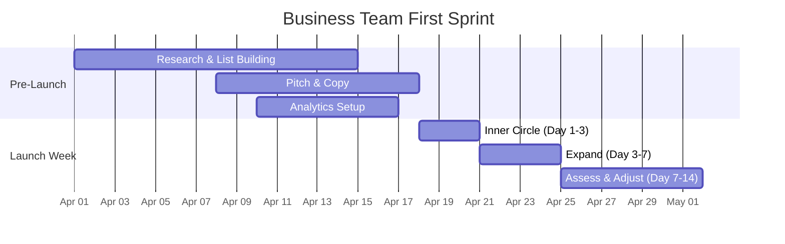
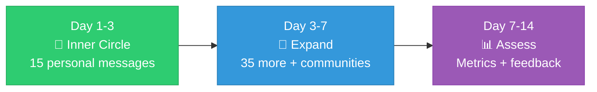

# Dateflow — Business Team First Sprint

> **TL;DR:** This sprint runs in parallel with MVP development. Prepare everything so that on launch day, users are waiting and channels are primed. Three tracks: Research, Copy, and Analytics.

---

## Sprint Timeline

---

## Pre-Launch Tasks

### Research & List Building

- [ ] **Build a target list of 50 people** in your network who are actively dating — names, how to reach them, when to ask. Prioritize genuine users, not just supportive friends.
- [ ] **Identify 10 Reddit threads** from the last 30 days describing the planning problem — bookmark for post-launch commenting.
- [ ] **Find 5 dating content creators** (50K-200K followers, TikTok/Reels) who've posted about first date struggles — compile DM outreach list.
- [ ] **Research 3 press contacts** at dating/women's lifestyle outlets — names, outlets, recent relevant articles.
- [ ] **Identify 3 dating-focused Discord servers** — join and participate genuinely before launch.

### Pitch & Copy

- [ ] **Draft OG link preview copy** — title with Person A's name, one-line description, image brief.
- [ ] **Write the safety press pitch** — one paragraph, ready to send launch week.
- [ ] **Write 3 creator DM variations** — short, authentic, no marketing speak. Offer early access.
- [ ] **Draft 5 Reddit comment templates** — natural responses to planning-problem threads. Starting points, not scripts.

### Analytics & Metrics

- [ ] **Define the metrics dashboard** — which numbers go on the pitch deck.
- [ ] **Set up PostHog** with event tracking for every funnel step. Must be live before first real user.

---

## Launch Week

### Day 1-3: Inner Circle

- [ ] Send personal messages to top 15 people. Individual texts, not group messages.
- [ ] Ask them to try it with a **real upcoming date**, not a test run.
- [ ] Collect feedback directly — what confused them, where they dropped off.

### Day 3-7: Expand

- [ ] Send to remaining 35 people on the list.
- [ ] Post authentic comments in bookmarked Reddit threads (only if still active).
- [ ] DM top 2 creators with early access.
- [ ] Mention Dateflow in Discord servers when someone describes the planning problem.

### Day 7-14: Assess & Adjust

- [ ] Review analytics: sessions completed, drop-off points.
- [ ] Person B completion rate < 60%? Landing page needs work → flag dev team.
- [ ] Match rate < 50%? Venue generation needs tuning → flag dev team.
- [ ] Send press pitch to 3 researched contacts.
- [ ] Ask first users: **"Would you use this again next time you have a date?"**

---

## Success Criteria

| Metric | Target |
|:-------|:------:|
| Completed session pairs | **25+** in first 2 weeks |
| Person B join rate | **≥ 70%** |
| Person B completion rate | **≥ 60%** |
| Match rate | **≥ 55%** |
| Creator outreach sent | **≥ 2 DMs** |
| Press pitch sent | **≥ 1** |

> Every data point is ammunition for the first meeting with Thursday.
