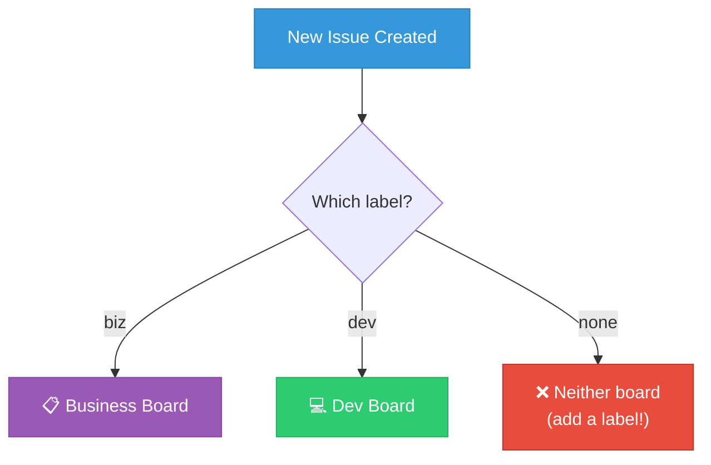

# Dateflow — Business Team Tooling

> **TL;DR:** The business team uses a GitHub Projects kanban board. Issues tagged `biz` auto-route to the business board. Dev issues tagged `dev` go to the dev board. Pick one tool. One source of truth.

---

## Board Setup

| Column | What goes here |
|--------|---------------|
| **Backlog** | All tasks not yet scheduled |
| **This Week** | Prioritized for current week |
| **In Progress** | Actively being worked on |
| **Waiting On** | Blocked — waiting on response or dependency |
| **Done** | Completed (archive periodically) |

---

## Label System

**Business sub-labels:**

| Label | Use for |
|-------|---------|
| `research` | Competitive analysis, market research, user interviews |
| `content` | Social media, creator outreach, press pitches, copy |
| `sales` | B2B outreach, partnerships, pitch materials |
| `analytics` | Metrics setup, dashboards, data analysis |

---

## How the Team Uses It

1. **All business tasks** = GitHub Issues with `biz` label
2. **Board URL is bookmarked** — this is the daily workspace
3. **Weekly standup:** review board, move cards, identify blockers
4. **Each card needs:** clear description, assigned owner, due date if time-sensitive

---

## If GitHub Projects Doesn't Work

| Tool | Best for | Cost |
|------|----------|------|
| **Notion** | All-in-one wiki + tasks. Business people already know it. | Free (small teams) |
| **Linear** | Fast startup teams. Has GitHub sync. | Free (small teams) |
| **Trello** | Pure kanban. Lowest learning curve. | Free |
| **Asana** | Marketing teams. Templates for campaigns. | Free (up to 10) |

> **Rule:** Pick one tool and commit. Half on Notion, half on GitHub = chaos.
