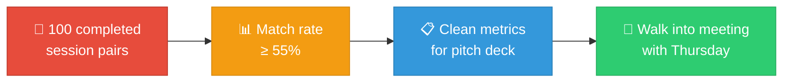
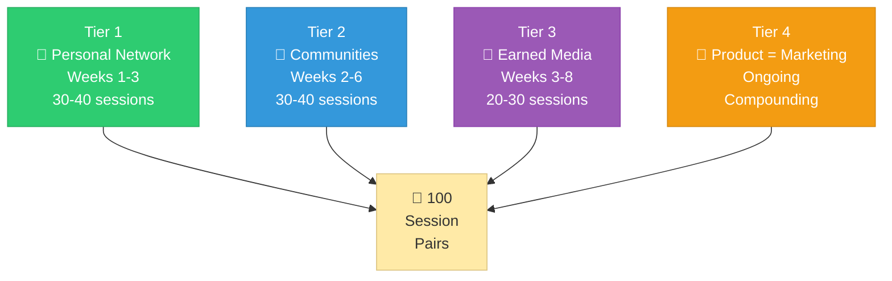
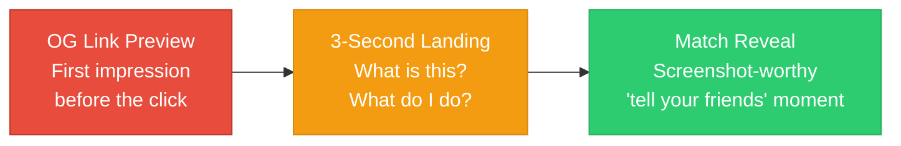
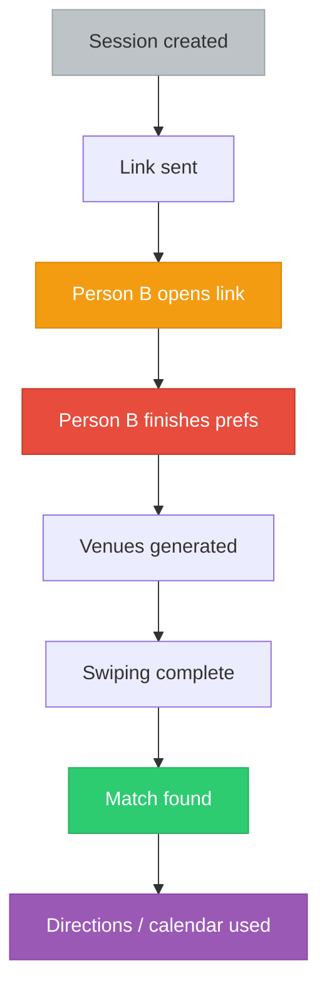

# Dateflow — User Acquisition Strategy

> **TL;DR:** Get 100 real session pairs with ≥55% match rate. That data is what sells B2B deals. Four tiers: personal network → communities → one press hit → the product itself. No paid ads. No content marketing. Scrappy and targeted.

---

## The Goal

This is **not a growth strategy.** This is a proof-of-concept seeding playbook.

---

## The Four Tiers

---

### Tier 1: Personal Network (Weeks 1-3)

**Target: 30-40 sessions**

| Action | Detail |
|--------|--------|
| **Direct outreach** | Individual texts to friends who are dating. "Hey I built this — next time you have a date, try it and tell me what sucked." |
| **Second-degree asks** | Each friend sends to one person they know who's dating. Doubles reach. |
| **University communities** | Students go on first dates constantly. One person in a group chat = 10+ sessions. |
| **Build a list of 50 people** | Names, how to reach them, best timing. |

> **Why this works:** Personal ask from a friend converts 10-50x better than any ad. Every session matters individually.

---

### Tier 2: Targeted Communities (Weeks 2-6)

**Target: 30-40 sessions**

| Platform | Strategy |
|----------|----------|
| **Reddit** | r/hingeapp, r/Tinder, r/dating_advice, r/datingoverthirty, r/bumble — find threads describing the planning failure. Reply authentically. |
| **Discord** | Join dating-focused servers. Be a member first. Offer the tool when someone describes the problem. |
| **Twitter/X** | Reply to "worst part of dating apps" moments. The structural misalignment argument plays well on tech Twitter. |

**Rules of engagement:**
1. Never spam — one bad post = banned permanently
2. Contribute before you promote — be a member for days first
3. Only mention Dateflow when it directly answers someone's stated problem

---

### Tier 3: One Piece of Earned Media (Weeks 3-8)

**Target: 20-30 sessions from a single hit**

| Channel | Approach |
|---------|----------|
| **Press — women's safety angle** | "The date planning app that filters for first-date safety." Pitch to Refinery29, The Cut, Bustle, Global Dating Insights. |
| **One creator video** | Find a dating creator (50K-200K followers) who's posted about the planning problem. DM them early access. Don't script it. |
| **Secondary press angle** | "The feature dating apps won't build" — the structural misalignment argument. |

---

### Tier 4: The Product as Marketing

Every session Person A creates is a marketing impression on Person B.

| Element | Why it matters |
|---------|---------------|
| **OG link preview** | A bare URL looks like phishing. A rich preview with Person A's name looks like a real product. |
| **3-second landing page** | Can't understand it in 3 seconds? Person B closes the tab. One button, not a form. |
| **Match reveal moment** | Peak emotional moment. Make it shareable. This is the "tell your friends" trigger. |

---

## What NOT to Do Yet

| Don't do this | Why not |
|--------------|---------|
| Paid ads | No product-market fit data to optimize against |
| Polished marketing website | Simple landing page is enough |
| Brand guidelines / logo redesign | Premature. Product will change. |
| Social media accounts | Nobody follows a startup's Instagram pre-launch |
| Blog / content marketing | Wrong stage, wrong audience |
| SEO | Payoff in 6-12 months. Need sessions in 6-12 weeks. |

---

## Analytics From Day One

**Measure every step.** The single metric that closes B2B deals:

> **"Apps using Dateflow show X% higher match-to-date conversion rate."**

Design analytics to capture this from session one. Even proxies (directions opened, calendar created) are better than nothing.
