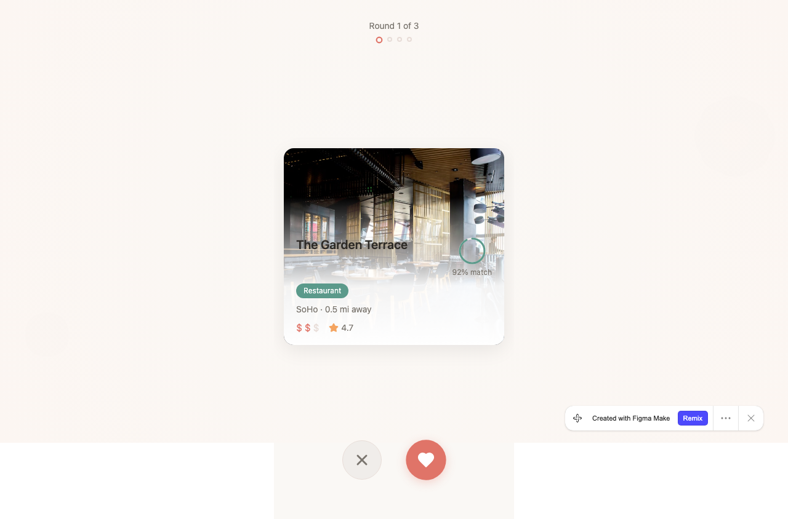
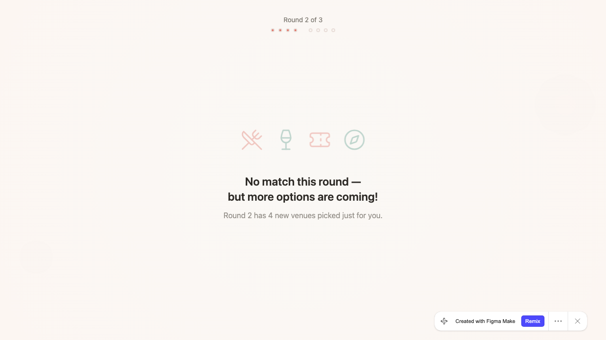

# Swipe & Match UI Review

**Source:** [FigmaMake Prototype](https://swim-maker-19414641.figma.site/)
**Date:** 2026-04-02
**Screens reviewed:** 7 (Swipe Clean, Swipe Immersive, Waiting for Partner, Match Confetti, Match Glow, No Match Transition, No Match End)

---

## What Works Well

- **Card layout is clean and familiar.** The Swipe Card - Clean variant borrows the right patterns from Hinge/Bumble — photo on top, info below, clear visual hierarchy. Users will intuitively know what to do.
- **Match reveal ("It's a match!") is effective.** The coral headline is celebratory without being obnoxious. Showing the matched venue card with "You and Alex both liked this spot" is a nice personal touch.
- **No Match End screen is well thought out.** Offering a "best suggestion" fallback with "Accept this suggestion" / "Try again with new preferences" / "or start a new session" gives users a clear off-ramp instead of a dead end.
- **Waiting for Partner screen is simple and calming.** The orbiting shapes + "You liked 2 of 4 places this round" feedback is a nice micro-detail.

---

## What Needs Work

### 1. Cut the Immersive variant

The photo overlay with text on top of the image kills readability. The venue name is barely legible. The card feels cramped and the information hierarchy collapses. The Clean variant is strictly better. Don't ship two options — pick Clean and move on.

### 2. Match score ring (67%) is confusing

What does 67% mean? Match to my preferences? To both preferences? AI confidence? This number will cause anxiety ("only 67%?") more than it helps. Either explain it with a tooltip/label, or remove it entirely and rely on the category tag + distance + price signals that users can actually interpret.

### 3. Swipe buttons are too small and too low

On a real phone, those buttons will be in the thumb's dead zone at the very bottom of the screen. They also lack labels — first-time users won't know if they can also swipe the card itself. Make the buttons larger (48px+ tap target minimum) and consider adding subtle text labels ("Pass" / "Like") beneath them.

### 4. No swipe gesture affordance on the card

There's no visual hint that the card is swipeable (slight tilt, drag shadow, peek of the next card behind). If you're building a swipe UX, the card needs to communicate "drag me." Right now it looks static.

### 5. Round/progress indicators are too subtle

"Round 1 of 3" at the top is tiny gray text. The dot indicators below it are nearly invisible. This is critical navigation context — it should be more prominent. Consider a progress bar or larger step indicator.

### 6. No Match Transition screen is empty

The screen with icons (fork, pin, smiley) and "No match this round — but more options are coming!" is generic and forgettable. The icons are disconnected from the brand. This is a moment where users might churn — consider showing a preview/teaser of what's coming in the next round to build anticipation.

### 7. Missing screens

- **Mid-swipe interaction** — what does a card look like while being dragged? Tilted with a like/pass overlay?
- **Card stack** — what happens when I swipe and the next card appears? Is there a stack effect?
- **Venue detail expansion** — can I tap to see more photos, reviews, hours? No expanded view is designed.
- **Both-liked indicator during swiping** — do I see what my partner liked in real-time, or only after the round?

### 8. Category tag needs an icon

The small green pill is doing a lot of work. Add an icon (fork for restaurant, cocktail for bar, etc.) to make scanning faster when swiping through multiple cards.

### 9. "Plan your date" CTA is vague

What does it do? Open Maps? Create a calendar event? Show a confirmation? The button text should hint at the next step: "Get directions," "Save the plan," or "View details."

---

## Recommendations (Priority Order)

1. Kill the Immersive variant — ship Clean only
2. Design the actual swipe interaction (mid-drag, release animation, card stack)
3. Add a venue detail/expanded view
4. Clarify or remove the % match score
5. Make swipe buttons bigger with labels (48px+ tap targets)
6. Flesh out the No Match Transition with something engaging

**Bottom line:** The bones are good. The gaps are in interaction design, not visual design.

---

## Screenshots

| Screen | File |
|--------|------|
| Swipe Card - Clean | [swipe-card-clean.png](swipe-card-clean.png) |
| Swipe Card - Immersive | [swipe-card-immersive.png](swipe-card-immersive.png) |
| Waiting for Partner | [waiting-for-partner.png](waiting-for-partner.png) |
| Match Reveal - Confetti | [match-reveal-confetti.png](match-reveal-confetti.png) |
| Match Reveal - Glow | [match-reveal-glow.png](match-reveal-glow.png) |
| No Match Transition | [no-match-transition.png](no-match-transition.png) |
| No Match End | [no-match-end.png](no-match-end.png) |
