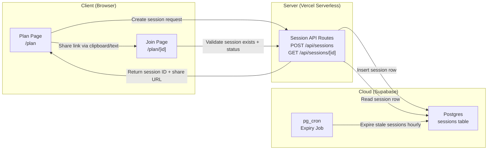
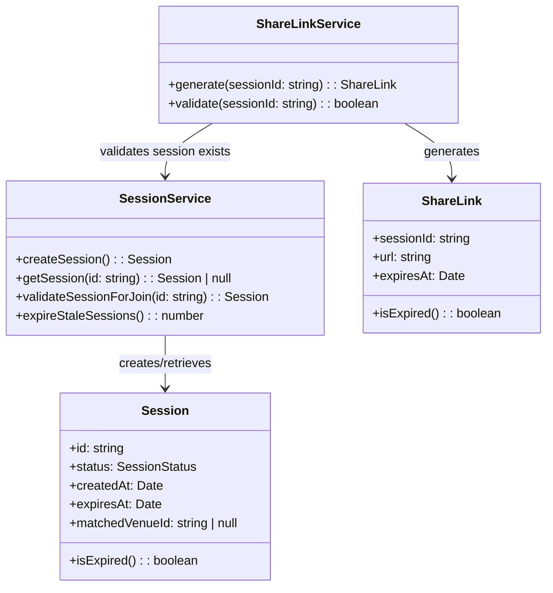
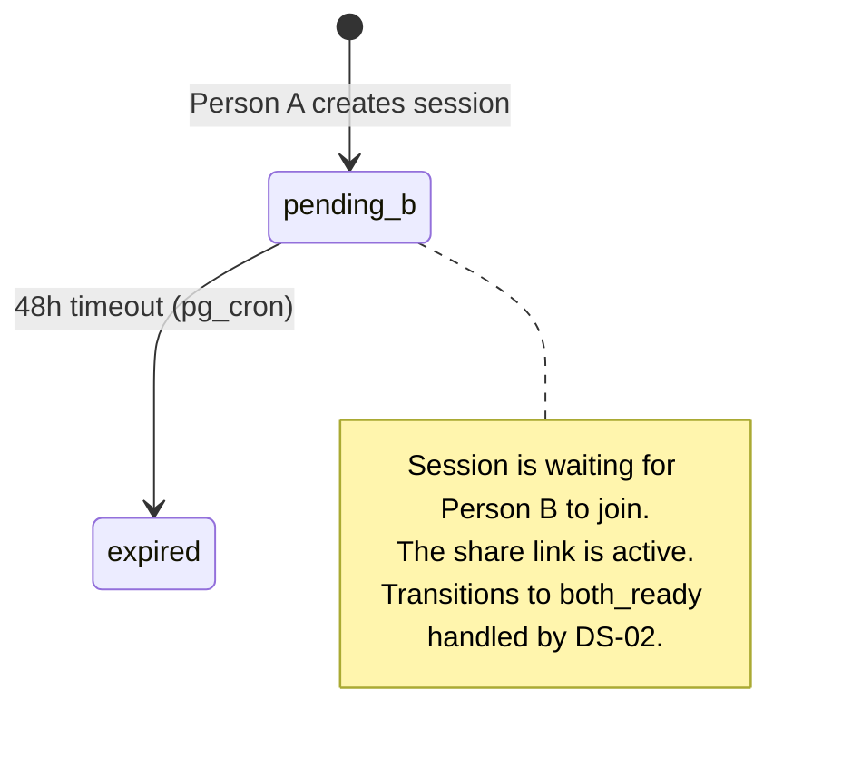
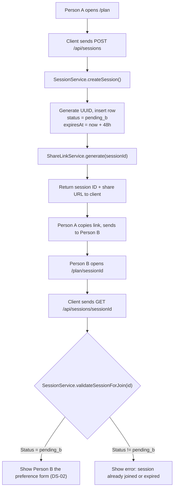

# DS-01 — Session Management

**Type:** Independent
**Depends on:** Nothing
**Depended on by:** DS-02 (Preference Input), DS-06 (Session History)
**User Stories:** US-01 (Start session without account), US-02 (Send invite link), US-03 (Join via link, no install)

---

## Architecture Diagram



**Where components run:**
- **Client:** Browser on the user's device (mobile-first web app, no install)
- **Server:** Vercel serverless functions (Next.js API routes), stateless, auto-scaling
- **Cloud:** Supabase Postgres for persistent session storage, pg_cron for scheduled expiry

**Information flows:**
- Client → Server: session creation request (no auth required), session ID for retrieval
- Server → Cloud: SQL insert/select on sessions table
- Server → Client: session object with ID, status, and generated share URL
- Cloud (internal): pg_cron marks expired sessions hourly

---

## Class Diagram



---

## List of Classes

### Session
**Type:** Entity
**Purpose:** Represents a planning session between two people. Created when Person A starts the flow, persists until matched or expired.
**Key fields:** `id` (UUID v4), `status` (enum), `createdAt`, `expiresAt` (createdAt + 48h), `matchedVenueId` (null until DS-04 sets it)
**Key methods:** `isExpired()` — compares `expiresAt` against current time

### SessionService
**Type:** Service
**Purpose:** All business logic for session lifecycle — creation, retrieval, validation for join, and batch expiry.
**Key methods:**
- `createSession()` — generates UUID, inserts row with status `pending_b`, returns Session
- `getSession(id)` — retrieves session by ID, returns null if not found
- `validateSessionForJoin(id)` — retrieves session, throws if status is not `pending_b` (already joined, expired, etc.)
- `expireStaleSessions()` — called by pg_cron, marks all sessions past `expiresAt` as `expired`, returns count updated

### ShareLink
**Type:** Value Object
**Purpose:** Encapsulates the shareable URL for a session invite. The URL is derived from the session ID and the app's base URL.
**Key fields:** `sessionId`, `url` (e.g., `https://dateflow.app/plan/{sessionId}`), `expiresAt` (matches session expiry)
**Key methods:** `isExpired()` — delegates to session expiry

### ShareLinkService
**Type:** Service
**Purpose:** Generates and validates session invite links.
**Key methods:**
- `generate(sessionId)` — constructs the ShareLink value object from session ID and `APP_URL` env var
- `validate(sessionId)` — checks that the session exists and is in `pending_b` status (link is still usable)

---

## State Diagram



DS-01 introduces only the `pending_b` and `expired` states. Downstream specs add transitions from `pending_b` onward.

---

## Flow Chart



---

## Development Risks and Failures

| Risk | Impact | Mitigation |
|---|---|---|
| UUID collision on session ID | Duplicate sessions, data corruption | UUID v4 collision probability is negligible (~2^-122). No mitigation needed beyond using `crypto.randomUUID()`. |
| Session created but share link never sent | Orphaned sessions consuming DB space | 48h expiry + pg_cron cleanup handles this automatically. |
| Person B opens link after expiry | Confusing dead-end | `validateSessionForJoin` returns a clear "this session has expired" message with a CTA to start a new one. |
| Supabase downtime during session creation | Session cannot be created | Return a 503 with "Try again in a moment." No retry logic needed for user-initiated actions. |
| pg_cron job fails or is delayed | Expired sessions remain in `pending_b` | The `isExpired()` method on Session checks expiry client-side as a secondary guard. Sessions are never served as active after expiry regardless of status field. |

---

## Technology Stack

| Component | Technology | Justification |
|---|---|---|
| API routes | Next.js App Router (Route Handlers) | Serverless, co-located with frontend |
| Database | Supabase Postgres | Managed Postgres with row-level security, realtime, and pg_cron |
| Scheduled jobs | pg_cron (Supabase extension) | Runs inside the database, no external scheduler needed |
| ID generation | `crypto.randomUUID()` (Node.js built-in) | Cryptographically random, no collision risk |
| Hosting | Vercel | Auto-scaling, edge network, zero-config deploys |

---

## APIs

### POST /api/sessions
**Purpose:** Create a new planning session.
**Auth:** None (no account required per US-01).
**Rate limit:** 5 per IP per hour.
**Request body:** None.
**Response (201):**
```json
{
  "session": {
    "id": "a1b2c3d4-...",
    "status": "pending_b",
    "createdAt": "2026-03-27T12:00:00Z",
    "expiresAt": "2026-03-29T12:00:00Z",
    "matchedVenueId": null
  },
  "shareLink": {
    "url": "https://dateflow.app/plan/a1b2c3d4-...",
    "expiresAt": "2026-03-29T12:00:00Z"
  }
}
```
**Error responses:**
- 429: Rate limit exceeded

### GET /api/sessions/[id]
**Purpose:** Retrieve current session state.
**Auth:** None.
**Rate limit:** 30 per IP per minute.
**Response (200):**
```json
{
  "session": {
    "id": "a1b2c3d4-...",
    "status": "pending_b",
    "createdAt": "2026-03-27T12:00:00Z",
    "expiresAt": "2026-03-29T12:00:00Z",
    "matchedVenueId": null
  }
}
```
**Error responses:**
- 404: Session not found
- 410: Session expired

---

## Public Interfaces

### SessionService Interface
```typescript
interface ISessionService {
  createSession(): Promise<Session>;
  getSession(id: string): Promise<Session | null>;
  validateSessionForJoin(id: string): Promise<Session>;
  expireStaleSessions(): Promise<number>;
}
```

### ShareLinkService Interface
```typescript
interface IShareLinkService {
  generate(sessionId: string): ShareLink;
  validate(sessionId: string): Promise<boolean>;
}
```

---

## Data Schemas

### sessions table
```sql
CREATE TABLE sessions (
  id              uuid PRIMARY KEY DEFAULT gen_random_uuid(),
  status          text NOT NULL DEFAULT 'pending_b'
                  CHECK (status IN ('pending_b','both_ready','generating','generation_failed','ready_to_swipe','matched','expired')),
  created_at      timestamptz NOT NULL DEFAULT now(),
  expires_at      timestamptz NOT NULL DEFAULT now() + interval '48 hours',
  matched_venue_id text
);

CREATE INDEX idx_sessions_status_expires ON sessions (status, expires_at)
  WHERE status NOT IN ('matched', 'expired');
```

### Session TypeScript Type
```typescript
type SessionStatus =
  | 'pending_b'
  | 'both_ready'
  | 'generating'
  | 'generation_failed'
  | 'ready_to_swipe'
  | 'matched'
  | 'expired';

type Session = {
  readonly id: string;
  readonly status: SessionStatus;
  readonly createdAt: Date;
  readonly expiresAt: Date;
  readonly matchedVenueId: string | null;
};

type ShareLink = {
  readonly sessionId: string;
  readonly url: string;
  readonly expiresAt: Date;
};
```

---

## Security and Privacy

- **No PII collected.** Session creation requires no personal data — no name, email, or phone number.
- **UUIDs are not guessable.** Session IDs are UUID v4 (122 bits of randomness). An attacker cannot enumerate sessions.
- **Rate limiting** on session creation (5/hr per IP) prevents resource exhaustion.
- **Expiry enforcement** at both the DB level (pg_cron marks expired) and application level (`isExpired()` check) ensures no stale session is ever served as active.
- **No server-side session cookies.** Sessions are identified by ID in the URL, not by cookies. This avoids CSRF concerns for the sessionless MVP.

---

## Risks to Completion

| Risk | Probability | Impact | Mitigation |
|---|---|---|---|
| Supabase pg_cron not available on free tier | Medium | Low — sessions still expire via app-level check; cleanup is deferred | Verify pg_cron availability during Supabase project setup. Fall back to Vercel Cron if needed. |
| Share link feels too long or technical for users | Low | Medium — reduces share rate if the URL looks intimidating | Use a short path (`/plan/[id]`) and rely on link preview (Open Graph tags) to make the link look inviting in chat apps. |
| Session creation rate limit too aggressive | Low | Low — 5/hr is generous for any real user | Monitor 429 response rate in PostHog. Adjust if legitimate users are blocked. |
