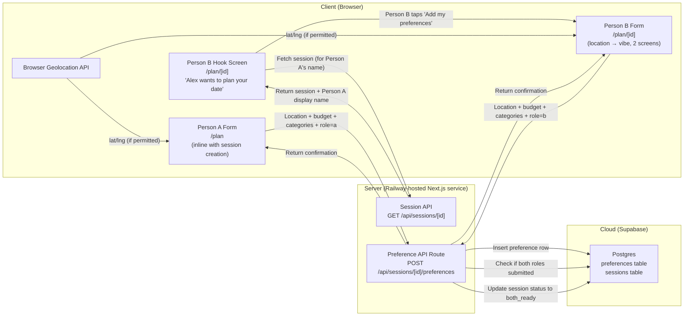
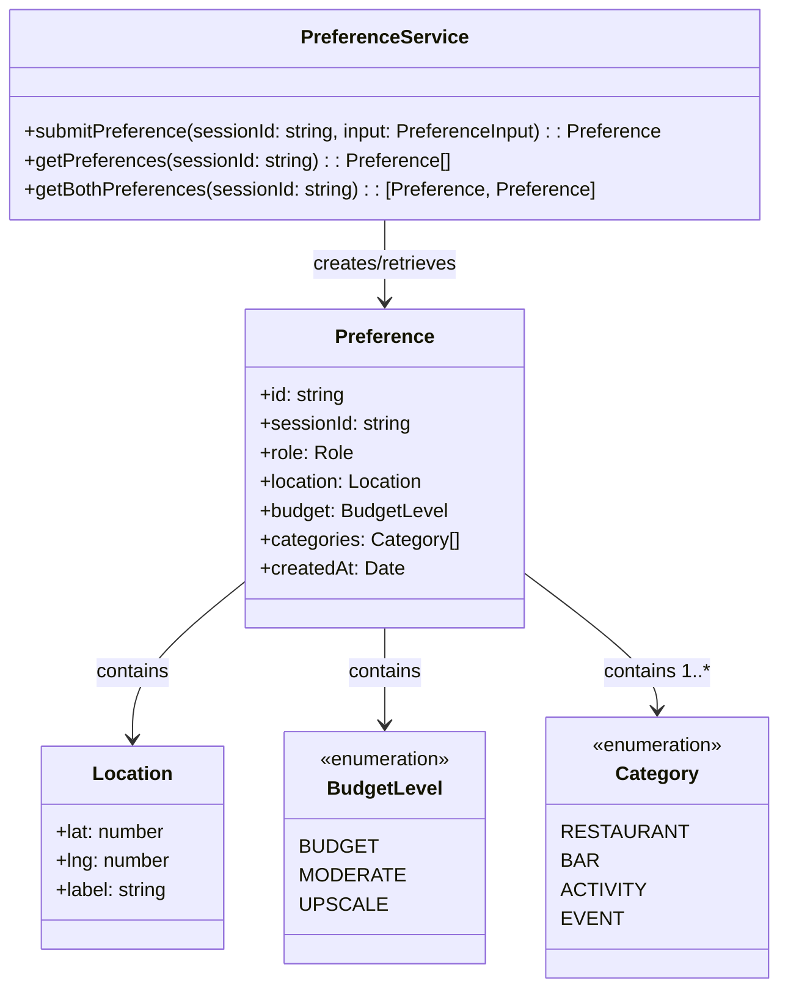
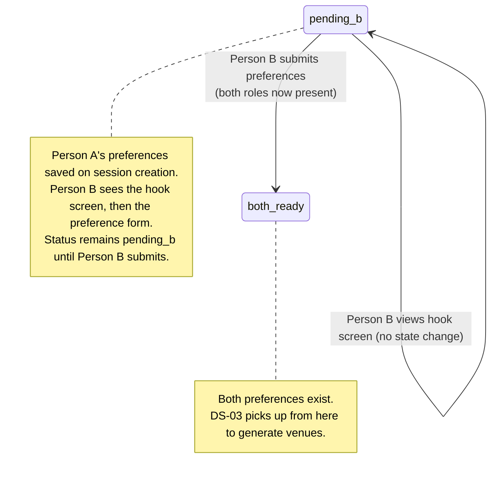
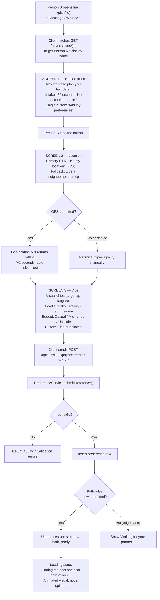

# DS-02 — Preference Input

**Type:** Dependent
**Depends on:** DS-01 (Session Management) — requires a session to exist before preferences can be submitted
**Depended on by:** DS-03 (Venue Generation Engine)
**User Stories:** US-04 (Enter location), US-05 (Set budget), US-06 (Select activity categories)

---

## Critical Design Context: Person A and Person B Are Not the Same User

Person A initiated this session voluntarily. They have context, know what Dateflow is, and are motivated — they want the date to happen. Person A can tolerate a slightly longer setup.

Person B clicked a link in a text message from someone they may barely know. They have zero context about Dateflow, zero prior investment in the product, and full permission to close the tab at any moment. Person B needs a fundamentally different experience.

**The preference form described in this spec collects the same data from both roles.** The API and data model are identical. What differs is the **client-side UX flow** — Person B's path through the form is compressed into fewer screens with a dedicated hook screen before any input is requested. See the Flow Chart section for both paths.

---

## Architecture Diagram



**Where components run:**
- **Client:** Browser — renders the hook screen (Person B only) and preference forms. Person A's form is part of the `/plan` session creation page. Person B's flow starts with a hook screen at `/plan/[id]` followed by a compressed 2-screen preference input.
- **Server:** Railway-hosted Next.js service — validates input, inserts preference, checks if both roles are filled, transitions session status
- **Cloud:** Supabase Postgres — stores preferences and session state

**Information flows:**
- Client → Server: preference data (location, budget, categories, role) — identical payload for both roles
- Server → Cloud: insert preference row, conditional update on session status
- Server → Client: confirmation with updated session status
- Browser Geolocation API → Client: lat/lng coordinates (optional, user-initiated)
- Server → Client (Person B only): session metadata including Person A's display name, used for the hook screen copy

---

## Class Diagram



---

## List of Classes

### Preference
**Type:** Entity
**Purpose:** Stores one user's inputs for a session — their location, budget ceiling, and activity category preferences. Each session has exactly two Preference rows (role `a` and role `b`).
**Key fields:** `id` (UUID), `sessionId` (FK to sessions), `role` (`a` or `b`), `location` (Location value object), `budget` (BudgetLevel enum), `categories` (array of Category enums), `createdAt`

### PreferenceService
**Type:** Service
**Purpose:** Handles preference submission with validation, enforces one preference per role per session, and manages the session status transition to `both_ready` when both roles have submitted.
**Key methods:**
- `submitPreference(sessionId, input)` — validates input, inserts preference row, checks if both roles are now present, transitions session to `both_ready` if so. Returns the created Preference.
- `getPreferences(sessionId)` — returns all preferences for a session (0, 1, or 2 rows).
- `getBothPreferences(sessionId)` — returns exactly two preferences or throws if not yet complete. Used by DS-03 during venue generation.

### Location
**Type:** Value Object
**Purpose:** Represents a geographic coordinate pair with an optional human-readable label (city name, neighborhood, or "Current Location").
**Key fields:** `lat` (number, -90 to 90), `lng` (number, -180 to 180), `label` (string, e.g., "Downtown Austin")

### BudgetLevel
**Type:** Enum
**Purpose:** Represents three tiers of spending comfort. Maps to Google Places `price_level` values.
**Values:** `BUDGET` (price_level 1), `MODERATE` (price_level 2), `UPSCALE` (price_level 3–4)

### Category
**Type:** Enum
**Purpose:** The types of activities a user is open to. Users select one or more. "Surprise me" in the UI selects all four categories.
**Values:** `RESTAURANT`, `BAR`, `ACTIVITY`, `EVENT`

---

## State Diagram



DS-02 owns the `pending_b → both_ready` transition. Person A submits preferences during session creation (status remains `pending_b`). Person B first sees the hook screen (a client-side state, no server transition), then completes the preference form. When Person B submits, the service detects both roles are present and transitions to `both_ready`.

---

## Flow Charts

Person A and Person B have distinct client-side flows that converge at the same API call.

### Person A Flow (Inline with Session Creation)

```mermaid
flowchart TD
    A1["Person A opens /plan"] --> A2{"GPS requested?"}
    A2 -- "Yes + permitted" --> A3["Browser Geolocation API returns lat/lng"]
    A2 -- "No or denied" --> A4["Enter zip code or city manually"]
    A3 --> A5["Select budget: $ / $$ / $$$"]
    A4 --> A5
    A5 --> A6["Select categories:<br/>restaurant, bar, activity, event, or 'surprise me'"]
    A6 --> A7["Client sends POST /api/sessions<br/>(creates session + saves Person A's preferences)"]
    A7 --> A8["ShareLinkService generates share URL"]
    A8 --> A9["Person A copies link, sends to Person B<br/>via iMessage / WhatsApp / Instagram DM"]
    A9 --> A10["Client shows 'Waiting for partner...'"]
```

Person A's flow is straightforward — they know what Dateflow is and are motivated to complete setup.

### Person B Flow (3 Screens, Under 60 Seconds)



**Key design decisions for Person B:**
- **Screen 1 is not a form.** It is a hook — one sentence, one button. Nothing else. Its job is to establish trust and context, not to collect data.
- **Screen 2 makes GPS the primary action.** "Use my location" is a large, prominent button. Manual input is a secondary fallback link below it. If GPS is permitted, this screen auto-advances in ~2 seconds.
- **Screen 3 uses visual chips, not dropdowns or text fields.** Category and budget are both on the same screen to reduce navigation. Large tap targets, no typing required.
- **The loading state does trust work.** "Finding the best spots for both of you" communicates that the result will be personalized to both people. An animated visual (not a spinner) signals that real computation is happening.
- **Target: Person B completes all 3 screens in 30–45 seconds.** This is achievable because Screen 1 is one tap, Screen 2 is one tap (with GPS), and Screen 3 is a few taps on visual chips.

---

## Development Risks and Failures

| Risk | Impact | Mitigation |
|---|---|---|
| Person B bounces at the hook screen without tapping the button | Session never completes, growth loop breaks | The hook screen must be minimal: one sentence with Person A's name, one button, no other distractions. Track hook-screen-to-form conversion rate in PostHog as a top-level metric. |
| Person B bounces during the preference form (screens 2–3) | Same as above | Keep Person B to 3 screens max, 30–45 second target. Visual chips and GPS auto-advance minimize required effort. Monitor per-screen drop-off. |
| User denies GPS permission | Person B's location screen requires manual input, adding friction | Always offer manual input (zip code or city search) as an immediately visible fallback. GPS is the primary CTA but manual input is not hidden behind a secondary menu. |
| Rich link preview doesn't render (Instagram DMs, some Android clients) | Person B sees a bare URL from a stranger, lower trust | The link path should be short and readable (`/plan/[id]`). Person A should see UI copy encouraging them to add a personal message alongside the link. This is a platform limitation, not a product failure. |
| Both users submit preferences simultaneously | Race condition on `both_ready` transition | Use `UPDATE sessions SET status = 'both_ready' WHERE id = $1 AND status = 'pending_b'` — only one UPDATE will return rowcount = 1. The "loser" still saves their preference row correctly; only the transition guard is contended. |
| Person A submits but Person B never opens the link | Session stuck in `pending_b` forever | 48h expiry (DS-01) handles cleanup. No user-facing issue. |
| Invalid lat/lng submitted | Bad midpoint calculation in DS-03 | Validate lat range (-90 to 90) and lng range (-180 to 180) server-side. Reject with 400 if out of bounds. |
| User selects zero categories | No venue types to search | UI requires at least one category or "surprise me" (which selects all four). Server-side validation rejects empty categories array. |

---

## Technology Stack

| Component | Technology | Justification |
|---|---|---|
| Preference form | React (Next.js client component) | Interactive form with conditional GPS prompt |
| Geolocation | Browser Geolocation API | Native, no library needed |
| Geocoding fallback | Google Geocoding API | Convert zip code / city name to lat/lng when GPS denied |
| API route | Next.js Route Handler | POST /api/sessions/[id]/preferences |
| Database | Supabase Postgres | Stores preferences with FK to sessions |
| Input validation | Zod | Schema validation at API boundary |

---

## APIs

### POST /api/sessions/[id]/preferences
**Purpose:** Submit one user's preferences for a session.
**Auth:** None.
**Rate limit:** 10 per IP per minute.
**Request body:**
```json
{
  "role": "a",
  "location": { "lat": 30.2672, "lng": -97.7431, "label": "Downtown Austin" },
  "budget": "MODERATE",
  "categories": ["RESTAURANT", "BAR"]
}
```
**Validation rules:**
- `role` must be `"a"` or `"b"`
- `location.lat` must be between -90 and 90
- `location.lng` must be between -180 and 180
- `location.label` must be a non-empty string, max 100 characters
- `budget` must be one of `"BUDGET"`, `"MODERATE"`, `"UPSCALE"`
- `categories` must be a non-empty array containing only `"RESTAURANT"`, `"BAR"`, `"ACTIVITY"`, `"EVENT"`

**Response (201):**
```json
{
  "preference": {
    "id": "b2c3d4e5-...",
    "sessionId": "a1b2c3d4-...",
    "role": "a",
    "location": { "lat": 30.2672, "lng": -97.7431, "label": "Downtown Austin" },
    "budget": "MODERATE",
    "categories": ["RESTAURANT", "BAR"],
    "createdAt": "2026-03-27T12:05:00Z"
  },
  "sessionStatus": "pending_b"
}
```
**Error responses:**
- 400: Validation failed (details in response body)
- 404: Session not found
- 409: Preference for this role already submitted in this session
- 410: Session expired

---

## Public Interfaces

### PreferenceService Interface
```typescript
interface IPreferenceService {
  submitPreference(sessionId: string, input: PreferenceInput): Promise<Preference>;
  getPreferences(sessionId: string): Promise<readonly Preference[]>;
  getBothPreferences(sessionId: string): Promise<readonly [Preference, Preference]>;
}

type PreferenceInput = {
  readonly role: Role;
  readonly location: Location;
  readonly budget: BudgetLevel;
  readonly categories: readonly Category[];
};

type Role = 'a' | 'b';
```

---

## Data Schemas

### preferences table
```sql
CREATE TABLE preferences (
  id          uuid PRIMARY KEY DEFAULT gen_random_uuid(),
  session_id  uuid NOT NULL REFERENCES sessions(id) ON DELETE CASCADE,
  role        text NOT NULL CHECK (role IN ('a', 'b')),
  location    jsonb NOT NULL,
  budget      text NOT NULL CHECK (budget IN ('BUDGET', 'MODERATE', 'UPSCALE')),
  categories  text[] NOT NULL CHECK (array_length(categories, 1) > 0),
  created_at  timestamptz NOT NULL DEFAULT now(),
  UNIQUE (session_id, role)
);
```

### Preference TypeScript Type
```typescript
type Location = {
  readonly lat: number;
  readonly lng: number;
  readonly label: string;
};

type BudgetLevel = 'BUDGET' | 'MODERATE' | 'UPSCALE';

type Category = 'RESTAURANT' | 'BAR' | 'ACTIVITY' | 'EVENT';

type Preference = {
  readonly id: string;
  readonly sessionId: string;
  readonly role: Role;
  readonly location: Location;
  readonly budget: BudgetLevel;
  readonly categories: readonly Category[];
  readonly createdAt: Date;
};
```

---

## Security and Privacy

- **Location data is ephemeral.** Lat/lng coordinates are stored only in the `preferences` table, which is cascade-deleted when the session is deleted (30 days after expiry per DS-01 cleanup policy).
- **No reverse geocoding stored.** The `label` field is user-provided or browser-provided ("Downtown Austin"), not a full address.
- **Input validation at the API boundary.** All fields are validated with Zod before any database interaction. Malformed input is rejected with 400.
- **Role uniqueness enforced at DB level.** The `UNIQUE (session_id, role)` constraint prevents a malicious client from overwriting another user's preferences.
- **No authentication required.** This is intentional for the MVP (US-01 requires no account). The trade-off is that anyone with the session ID can submit preferences — acceptable because session IDs are UUID v4 and not guessable.

---

## Risks to Completion

| Risk | Probability | Impact | Mitigation |
|---|---|---|---|
| Person B hook screen design takes multiple iterations to get right | High | Medium — delays the most critical conversion point | Design the hook screen first, before building the preference form. Test with 5–10 real people sending links to real matches. Iterate on copy and layout before writing production code. |
| Google Geocoding API adds cost for manual location input | Medium | Low — cost is negligible at MVP volume (<$1/day) | Monitor usage. Consider free alternatives (Nominatim) if cost becomes meaningful. |
| Zod validation schema drifts from DB constraints | Low | Medium — server accepts data the DB rejects, or vice versa | Single source of truth: define Zod schema first, derive DB constraints from it. Review both in PR. |
| "Surprise me" category mapping is ambiguous to users | Medium | Low — user selects it expecting magic but gets all four categories | UI copy should clarify: "Surprise me — show everything nearby" |
| OG meta tags require dynamic rendering (Person A's name in the preview) | Low | Low — requires SSR or edge function to inject per-session metadata | The `/plan/[id]` page already uses SSR (Next.js). OG tags are rendered server-side from the session's `creator_display_name` field. |
