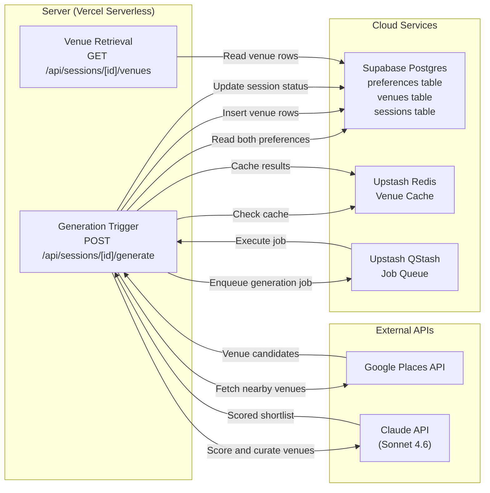
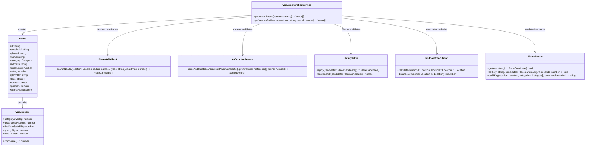
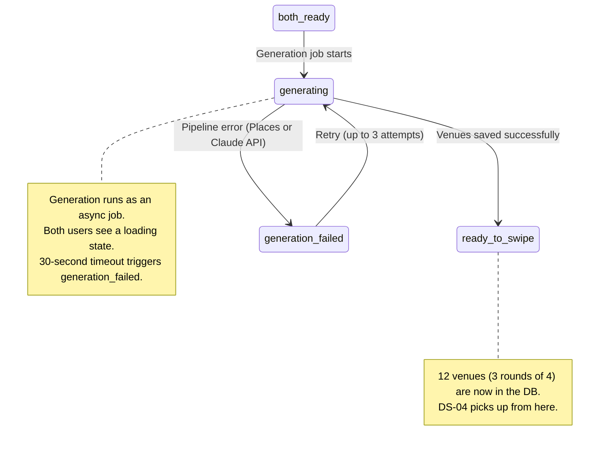
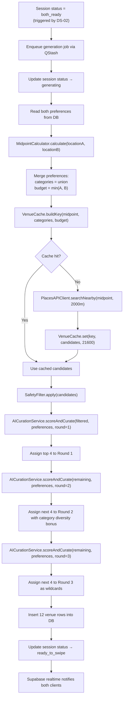

# DS-03 — Venue Generation Engine

**Type:** Dependent
**Depends on:** DS-02 (Preference Input) — requires both preferences to exist before generation can run
**Depended on by:** DS-04 (Swipe & Match System)
**User Stories:** US-07 (Venues filtered for first-date safety), US-12 (Venues equidistant from both people)

---

## Architecture Diagram



**Where components run:**
- **Server:** Vercel serverless — generation logic runs as an async job triggered via QStash
- **Cloud:** Supabase Postgres (venue storage), Upstash Redis (Places API cache), Upstash QStash (async job queue)
- **External:** Google Places API (venue candidate data), Claude API (AI curation and safety scoring)

**Information flows:**
- DS-02 triggers generation by enqueuing a QStash job when session transitions to `both_ready`
- Server reads both preferences from Postgres, checks Redis cache for nearby venues
- On cache miss: server calls Google Places API, stores results in Redis (6h TTL)
- Server sends candidates to Claude for scoring and curation
- Server inserts scored venue rows into Postgres, updates session status to `ready_to_swipe`
- DS-04 reads venues via GET /api/sessions/[id]/venues

---

## Class Diagram



---

## List of Classes

### Venue
**Type:** Entity
**Purpose:** A venue candidate in a session's shortlist. Created during generation, consumed by DS-04 during swiping. Each venue belongs to a specific round (1, 2, or 3) and has a display position within that round.
**Key fields:** `id` (UUID), `sessionId` (FK), `placeId` (Google Places ID), `name`, `category` (Category enum from DS-02), `address`, `priceLevel` (1–4), `rating` (0–5), `photoUrl`, `tags` (string array, e.g., `["conversation-friendly", "outdoor"]`), `round` (1, 2, or 3), `position` (display order within round), `score` (VenueScore)

### VenueScore
**Type:** Value Object
**Purpose:** The five weighted scoring dimensions used to rank a venue for a specific session. Stored alongside the venue for transparency and debugging.
**Key fields:**
- `categoryOverlap` (0–1, weight 0.30) — how well the venue's type matches both users' selected categories
- `distanceToMidpoint` (0–1, weight 0.25) — inverse of distance from geographic midpoint; closer = higher
- `firstDateSuitability` (0–1, weight 0.25) — AI-scored: noise level, public safety, ease of exit, ambiance
- `qualitySignal` (0–1, weight 0.15) — normalized Google rating adjusted by log(review_count)
- `timeOfDayFit` (0–1, weight 0.05) — whether the venue is appropriate for the selected time
**Key methods:** `composite()` — returns the weighted sum of all dimensions

### VenueGenerationService
**Type:** Service
**Purpose:** The orchestrator of the entire generation pipeline. Called as an async job. Reads preferences, calculates midpoint, checks cache, fetches candidates, filters for safety, scores with AI, and saves the shortlist.
**Key methods:**
- `generateVenues(sessionId)` — runs the full pipeline for all three rounds (12 venues total). Updates session status from `generating` to `ready_to_swipe` on success, or to `generation_failed` on failure.
- `getVenuesForRound(sessionId, round)` — retrieves only the venues assigned to a specific round. Used by DS-04 to progressively load rounds.

### PlacesAPIClient
**Type:** Client
**Purpose:** Wrapper around the Google Places Nearby Search API. Fetches venue candidates within a radius of a location, filtered by type and price level.
**Key methods:** `searchNearby(location, radius, types, maxPrice)` — returns an array of PlaceCandidate objects with name, address, rating, price_level, photo references, and place_id.

### AICurationService
**Type:** Client
**Purpose:** Wrapper around the Claude API (Sonnet 4.6). Sends venue candidates and user preferences to Claude for scoring on first-date suitability, and returns a ranked shortlist with tags and explanations.
**Key methods:** `scoreAndCurate(candidates, preferences, round)` — sends a structured prompt with candidates and both users' preferences. Returns scored venues with first-date suitability ratings and generated tags. Round number affects prompt behavior (round 3 = "wildcard picks, surprise them").

### SafetyFilter
**Type:** Filter
**Purpose:** Filters venue candidates for first-date safety criteria. Eliminates venues that are private, inaccessible by transit, or otherwise inappropriate for meeting a stranger. This implements US-07 directly.
**Key methods:**
- `apply(candidates)` — removes candidates that fail safety criteria. Returns the filtered list.
- `scoreSafety(candidate)` — returns a 0–1 safety score for a single candidate. Used as input to the `firstDateSuitability` dimension in VenueScore.

**Safety criteria:**
- Must be a public commercial establishment (not a private residence, private club, or invite-only venue)
- Must be accessible by transit or rideshare (not remote or highway-only access)
- Must have a Google rating of at least 3.5 with at least 50 reviews (quality floor)
- Noise level should allow conversation (AI-assessed from reviews)
- No venues that require multi-hour commitments (e.g., tasting menus, escape rooms)

### MidpointCalculator
**Type:** Utility
**Purpose:** Calculates the geographic midpoint between two locations. Uses the Haversine formula for accuracy on a spherical earth. Also calculates distance between two points (used for distance-to-midpoint scoring).
**Key methods:**
- `calculate(locationA, locationB)` — returns a Location representing the geographic midpoint
- `distanceBetween(a, b)` — returns distance in meters between two points

### VenueCache
**Type:** Cache
**Purpose:** Redis cache for Google Places API results. Prevents redundant API calls when multiple sessions query similar areas. Uses Upstash Redis for serverless compatibility.
**Key methods:**
- `get(key)` — returns cached PlaceCandidate array or null
- `set(key, candidates, ttlSeconds)` — stores candidates with a 6-hour TTL
- `buildKey(location, categories, priceLevel)` — constructs cache key from coordinates (rounded to 2 decimal places), sorted categories, and price level

---

## State Diagram



DS-03 owns the transitions: `both_ready → generating`, `generating → ready_to_swipe`, `generating → generation_failed`, `generation_failed → generating` (retry).

---

## Flow Chart



---

## Development Risks and Failures

| Risk | Impact | Mitigation |
|---|---|---|
| Google Places returns fewer than 12 candidates for the area | Fewer venues per round, possibly empty rounds | Search with expanding radius (2km → 5km → 10km). If still under 12, generate what's available and cap at actual count. Never fail the pipeline for low candidate count. |
| Claude API is unavailable or slow | Generation stalls or times out | Fall back to pure Places API ranking: sort by rating * log(reviews), skip AI curation. Mark venues as "unscored" in tags. |
| Claude returns malformed scoring data | Venue scores are invalid, round assignment fails | Validate Claude response against a Zod schema. On parse failure, retry once with a stricter prompt. On second failure, fall back to Places-only ranking. |
| Places API quota exceeded | No candidates returned for any session | Monitor quota via Google Cloud Console. Set alert at 80% of daily quota. If exceeded, return 503 and ask user to retry later. |
| Midpoint falls in an area with no venues (river, highway, park) | All candidates are distant and scored poorly | Detect when nearest candidate is >5km from midpoint. In that case, run two separate searches centered on each user's location and merge results. |
| Safety filter is too aggressive and removes most candidates | Too few venues survive filtering | Set minimum candidate floor: if safety filter reduces candidates below 15, relax the review count threshold (50 → 20) and rerun. Log these events for manual review of filter calibration. |

---

## Technology Stack

| Component | Technology | Justification |
|---|---|---|
| Job queue | Upstash QStash | Serverless, HTTP-based, built-in retries and exponential backoff |
| Venue cache | Upstash Redis | Serverless Redis, pay-per-request, supports TTL natively |
| Venue data | Google Places API (Nearby Search) | Best global coverage, ratings, photos, hours, price levels |
| AI curation | Claude API (Sonnet 4.6) | Strong structured output, can score multiple venues in a single call |
| Midpoint math | Custom utility (Haversine formula) | No external dependency needed, ~20 lines of code |
| Response validation | Zod | Validates Claude API response structure before processing |

---

## APIs

### POST /api/sessions/[id]/generate
**Purpose:** Trigger venue generation for a session. Called internally when session transitions to `both_ready`. Not called by the client directly.
**Auth:** QStash signature verification (prevents unauthorized triggers).
**Request body:**
```json
{
  "sessionId": "a1b2c3d4-..."
}
```
**Response (202):** `{ "status": "generating" }`
**Error responses:**
- 400: Session not in `both_ready` or `generation_failed` status
- 404: Session not found
- 500: Generation pipeline failure (after 3 retries)

### GET /api/sessions/[id]/venues
**Purpose:** Retrieve the venue shortlist for a session, optionally filtered by round.
**Auth:** None.
**Query params:** `round` (optional, 1–3)
**Response (200):**
```json
{
  "venues": [
    {
      "id": "c3d4e5f6-...",
      "placeId": "ChIJ...",
      "name": "Whisler's",
      "category": "BAR",
      "address": "1816 E 6th St, Austin, TX",
      "priceLevel": 2,
      "rating": 4.5,
      "photoUrl": "https://maps.googleapis.com/...",
      "tags": ["conversation-friendly", "outdoor-patio", "walkable"],
      "round": 1,
      "position": 1,
      "score": {
        "categoryOverlap": 0.9,
        "distanceToMidpoint": 0.8,
        "firstDateSuitability": 0.85,
        "qualitySignal": 0.75,
        "timeOfDayFit": 0.9,
        "composite": 0.845
      }
    }
  ],
  "totalRounds": 3,
  "currentRound": 1
}
```
**Error responses:**
- 404: Session not found
- 409: Session not yet in `ready_to_swipe` status (venues not generated yet)

---

## Public Interfaces

### VenueGenerationService Interface
```typescript
interface IVenueGenerationService {
  generateVenues(sessionId: string): Promise<readonly Venue[]>;
  getVenuesForRound(sessionId: string, round: number): Promise<readonly Venue[]>;
}
```

### PlacesAPIClient Interface
```typescript
type PlaceCandidate = {
  readonly placeId: string;
  readonly name: string;
  readonly address: string;
  readonly types: readonly string[];
  readonly priceLevel: number;
  readonly rating: number;
  readonly reviewCount: number;
  readonly photoReference: string | null;
  readonly location: Location;
};

interface IPlacesAPIClient {
  searchNearby(
    location: Location,
    radius: number,
    types: readonly string[],
    maxPrice: number
  ): Promise<readonly PlaceCandidate[]>;
}
```

### AICurationService Interface
```typescript
type ScoredVenue = {
  readonly placeId: string;
  readonly score: VenueScore;
  readonly tags: readonly string[];
};

interface IAICurationService {
  scoreAndCurate(
    candidates: readonly PlaceCandidate[],
    preferences: readonly [Preference, Preference],
    round: number
  ): Promise<readonly ScoredVenue[]>;
}
```

### SafetyFilter Interface
```typescript
interface ISafetyFilter {
  apply(candidates: readonly PlaceCandidate[]): readonly PlaceCandidate[];
  scoreSafety(candidate: PlaceCandidate): number;
}
```

### MidpointCalculator Interface
```typescript
interface IMidpointCalculator {
  calculate(locationA: Location, locationB: Location): Location;
  distanceBetween(a: Location, b: Location): number;
}
```

### VenueCache Interface
```typescript
interface IVenueCache {
  get(key: string): Promise<readonly PlaceCandidate[] | null>;
  set(key: string, candidates: readonly PlaceCandidate[], ttlSeconds: number): Promise<void>;
  buildKey(location: Location, categories: readonly Category[], priceLevel: number): string;
}
```

---

## Data Schemas

### venues table
```sql
CREATE TABLE venues (
  id              uuid PRIMARY KEY DEFAULT gen_random_uuid(),
  session_id      uuid NOT NULL REFERENCES sessions(id) ON DELETE CASCADE,
  place_id        text NOT NULL,
  name            text NOT NULL,
  category        text NOT NULL CHECK (category IN ('RESTAURANT','BAR','ACTIVITY','EVENT')),
  address         text NOT NULL,
  price_level     int NOT NULL CHECK (price_level BETWEEN 1 AND 4),
  rating          numeric NOT NULL CHECK (rating BETWEEN 0 AND 5),
  photo_url       text,
  tags            text[] NOT NULL DEFAULT '{}',
  round           int NOT NULL CHECK (round BETWEEN 1 AND 3),
  position        int NOT NULL CHECK (position BETWEEN 1 AND 4),
  score_category_overlap       numeric NOT NULL,
  score_distance_to_midpoint   numeric NOT NULL,
  score_first_date_suitability numeric NOT NULL,
  score_quality_signal         numeric NOT NULL,
  score_time_of_day_fit        numeric NOT NULL,
  score_composite              numeric NOT NULL,
  UNIQUE (session_id, round, position)
);

CREATE INDEX idx_venues_session_round ON venues (session_id, round);
```

### Venue TypeScript Type
```typescript
type VenueScore = {
  readonly categoryOverlap: number;
  readonly distanceToMidpoint: number;
  readonly firstDateSuitability: number;
  readonly qualitySignal: number;
  readonly timeOfDayFit: number;
};

type Venue = {
  readonly id: string;
  readonly sessionId: string;
  readonly placeId: string;
  readonly name: string;
  readonly category: Category;
  readonly address: string;
  readonly priceLevel: number;
  readonly rating: number;
  readonly photoUrl: string | null;
  readonly tags: readonly string[];
  readonly round: number;
  readonly position: number;
  readonly score: VenueScore;
};
```

---

## Security and Privacy

- **API keys are server-side only.** Google Places API key and Anthropic API key are never exposed to the client. All external API calls happen in serverless functions.
- **QStash signature verification.** The generate endpoint validates the QStash signature header to prevent unauthorized job triggers.
- **No user-generated content in AI prompts.** The Claude prompt contains only venue data from Google Places and structured preference data (enums and coordinates). No free-text user input enters the prompt, eliminating prompt injection risk.
- **Cached data is not session-specific.** The venue cache stores anonymized Google Places results keyed by location grid + categories. No session ID or user data is in the cache.
- **Photo URLs are proxied.** Google Places photo references are resolved server-side to prevent leaking the API key through client-side photo requests.

---

## Risks to Completion

| Risk | Probability | Impact | Mitigation |
|---|---|---|---|
| Claude prompt engineering requires many iterations to produce consistent scoring | High | Medium — delays generation quality, not availability | Start with a simple prompt and test against 50 real venue sets. Iterate scoring weights based on manual review of output quality. |
| Google Places API pricing changes | Low | High — could significantly increase per-session cost | Monitor Google Cloud billing alerts. Places API has a $200/month free credit. At MVP volume (<100 sessions/day), total cost is ~$15–30/day. |
| Venue quality varies dramatically by city | High | High — product feels broken in sparse areas | Launch in one city (Austin) with known venue density. Manually verify generation quality for launch city before opening to others. |
| 12 venues may not be enough in very dense areas where users expect more options | Low | Low — users may feel artificially constrained | Cap at 12 is intentional (prevents decision paralysis). Monitor session match rates; if consistently >80% match in round 1, consider reducing to 8. |
