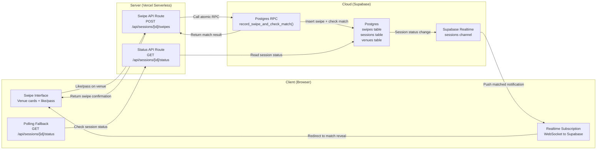
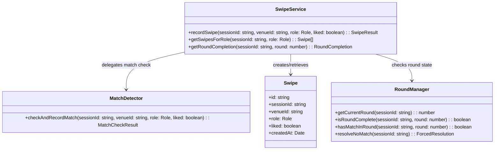
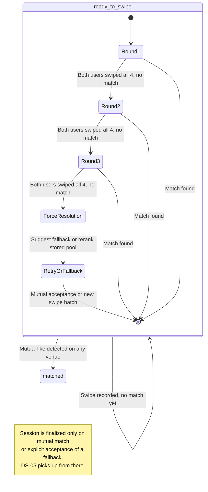
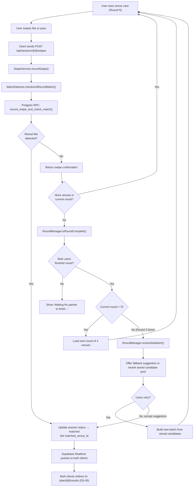

# DS-04 — Swipe & Match System

**Type:** Dependent
**Depends on:** DS-03 (Venue Generation Engine) — requires venues to exist before swiping can begin
**Depended on by:** DS-05 (Post-Match Actions)
**User Stories:** US-10 (Swipe on venues privately), US-11 (Match reveal), US-13 (Second/third round if no match)

> Follow-up design: see [DS-03A — Candidate Pool Persistence & Low-Cost Regeneration](./ds-03a-candidate-pool-regeneration.md). DS-04 should evolve from forced auto-match after round 3 to a bounded retry/suggestion flow that can re-score stored candidates before paying for a full regeneration.

---

## Architecture Diagram



**Where components run:**
- **Client:** Browser — renders swipe cards, maintains WebSocket connection for realtime updates, falls back to polling if WebSocket drops
- **Server:** Vercel serverless — receives swipe submissions, invokes Postgres RPC for atomic match detection
- **Cloud:** Supabase Postgres (swipes storage, atomic RPC function, session state), Supabase Realtime (WebSocket push to both clients)

**Information flows:**
- Client → Server: swipe decision (venue ID, liked boolean, role)
- Server → Cloud: atomic RPC call that inserts swipe and checks for mutual match in a single transaction
- Cloud → Server: match result (matched: true/false)
- Cloud → Client: Supabase Realtime pushes session status changes to both connected clients
- Client → Server (fallback): polling every 5 seconds if WebSocket disconnects

---

## Class Diagram



---

## List of Classes

### Swipe
**Type:** Entity
**Purpose:** Records a single user's like or pass decision on a specific venue within a session. The combination of `(sessionId, venueId, role)` is unique — a user can only swipe once per venue (re-swiping updates the existing record).
**Key fields:** `id` (UUID), `sessionId` (FK to sessions), `venueId` (FK to venues), `role` (`a` or `b`), `liked` (boolean), `createdAt`

### SwipeService
**Type:** Service
**Purpose:** Orchestrates swipe recording and round management. Validates the swipe is for a valid venue in the current session, delegates to MatchDetector for atomic match checking, and queries RoundManager to determine if a new round should load.
**Key methods:**
- `recordSwipe(sessionId, venueId, role, liked)` — validates input, calls MatchDetector, returns SwipeResult (contains match status and whether the current round is complete for both users).
- `getSwipesForRole(sessionId, role)` — returns all swipes for a specific user in a session. Used by the client to restore swipe state on page reload.
- `getRoundCompletion(sessionId, round)` — returns how many venues in the round each role has swiped on. Used to determine when to reveal the next round.

### MatchDetector
**Type:** Service
**Purpose:** Wraps the Postgres RPC function `record_swipe_and_check_match()`. This is the atomic operation that prevents race conditions: it inserts the swipe and checks for a mutual like in a single transaction with row-level locking.
**Key methods:** `checkAndRecordMatch(sessionId, venueId, role, liked)` — calls the RPC, returns a MatchCheckResult indicating whether a match was detected.

### RoundManager
**Type:** Service
**Purpose:** Manages the progressive round mechanic (3 rounds of 4 venues). Determines which round both users are currently in, whether a round is complete (both users have swiped on all 4 venues in the round), and triggers the no-match fallback after round 3.
**Key methods:**
- `getCurrentRound(sessionId)` — returns 1, 2, or 3 based on how many rounds have been completed
- `isRoundComplete(sessionId, round)` — returns true if both users have swiped on all 4 venues in the round
- `hasMatchInRound(sessionId, round)` — returns true if any venue in the round was liked by both users
- `resolveNoMatch(sessionId)` — called after round 3 if no mutual match exists. Preferred long-term behavior is to produce a fallback suggestion or bounded retry path rather than silently forcing a true match.

---

## State Diagram



DS-04 owns the `ready_to_swipe → matched` transition and the internal round progression within `ready_to_swipe`.

---

## Flow Chart



---

## Development Risks and Failures

| Risk | Impact | Mitigation |
|---|---|---|
| Both users swipe on the same venue within milliseconds (race condition) | Double match detection, inconsistent state | Postgres RPC with `FOR UPDATE` row lock ensures exactly one match is recorded. The `WHERE status != 'matched'` guard prevents double-setting. |
| WebSocket connection drops mid-session | User misses match notification, thinks nothing happened | Client polls `GET /api/sessions/[id]/status` every 5 seconds as fallback. Page reload recovers full state from DB. |
| User closes browser and reopens later | Swipe progress lost | All swipes are persisted in DB immediately. On page load, `getSwipesForRole()` restores which venues have been swiped, so the user picks up where they left off. |
| Users swipe at very different speeds | Fast user waits for slow user to finish a round before next round loads | Show "Waiting for partner to finish this round..." state. Round transition only fires when both users have swiped all 4 venues in the current round. |
| Force resolution after round 3 feels misleading | Users may feel trapped into a venue they did not both choose | Prefer bounded retry or explicit fallback acceptance. Reserve `matched` for mutual like or mutual acceptance. |
| Duplicate swipe submissions (double-tap, network retry) | Duplicate swipe rows, inflated counts | `UNIQUE (session_id, venue_id, role)` constraint + `ON CONFLICT DO UPDATE` makes swipes idempotent. |

---

## Technology Stack

| Component | Technology | Justification |
|---|---|---|
| Atomic match detection | Postgres RPC (PL/pgSQL) | Single-transaction swipe + match check with row-level locking |
| Realtime push | Supabase Realtime (WebSocket) | Native integration with Postgres changes, no additional infrastructure |
| Polling fallback | Next.js API route | Simple GET endpoint as WebSocket backup |
| Swipe UI | React (client component) | Touch-friendly swipe gestures, optimistic UI updates |
| Swipe animation | Framer Motion | Smooth card swipe animations, Spring physics |

---

## APIs

### POST /api/sessions/[id]/swipes
**Purpose:** Record a swipe decision and atomically check for a match.
**Auth:** None.
**Rate limit:** 60 per IP per minute.
**Request body:**
```json
{
  "venueId": "c3d4e5f6-...",
  "role": "a",
  "liked": true
}
```
**Validation rules:**
- `venueId` must reference an existing venue in this session
- `role` must be `"a"` or `"b"`
- `liked` must be a boolean

**Response (200):**
```json
{
  "swipe": {
    "id": "d4e5f6g7-...",
    "sessionId": "a1b2c3d4-...",
    "venueId": "c3d4e5f6-...",
    "role": "a",
    "liked": true,
    "createdAt": "2026-03-27T12:10:00Z"
  },
  "matched": false,
  "roundComplete": false,
  "currentRound": 1
}
```
**When matched:**
```json
{
  "swipe": { "..." : "..." },
  "matched": true,
  "matchedVenueId": "c3d4e5f6-...",
  "currentRound": 1
}
```
**Error responses:**
- 400: Validation failed
- 404: Session or venue not found
- 409: Session not in `ready_to_swipe` status
- 410: Session expired

### GET /api/sessions/[id]/status
**Purpose:** Poll session status (WebSocket fallback).
**Auth:** None.
**Rate limit:** 30 per IP per minute.
**Response (200):**
```json
{
  "status": "ready_to_swipe",
  "matchedVenueId": null,
  "currentRound": 1,
  "roundComplete": false
}
```
**Error responses:**
- 404: Session not found

---

## Public Interfaces

### SwipeService Interface
```typescript
type SwipeResult = {
  readonly swipe: Swipe;
  readonly matched: boolean;
  readonly matchedVenueId: string | null;
  readonly roundComplete: boolean;
  readonly currentRound: number;
};

type RoundCompletion = {
  readonly round: number;
  readonly roleACount: number;
  readonly roleBCount: number;
  readonly total: number;
  readonly complete: boolean;
};

interface ISwipeService {
  recordSwipe(sessionId: string, venueId: string, role: Role, liked: boolean): Promise<SwipeResult>;
  getSwipesForRole(sessionId: string, role: Role): Promise<readonly Swipe[]>;
  getRoundCompletion(sessionId: string, round: number): Promise<RoundCompletion>;
}
```

### MatchDetector Interface
```typescript
type MatchCheckResult = {
  readonly matched: boolean;
  readonly venueId: string;
};

interface IMatchDetector {
  checkAndRecordMatch(
    sessionId: string,
    venueId: string,
    role: Role,
    liked: boolean
  ): Promise<MatchCheckResult>;
}
```

### RoundManager Interface
```typescript
type ForcedResolution = {
  readonly venueId: string;
  readonly reason: 'mutual_partial' | 'single_like' | 'highest_scored';
};

interface IRoundManager {
  getCurrentRound(sessionId: string): Promise<number>;
  isRoundComplete(sessionId: string, round: number): Promise<boolean>;
  hasMatchInRound(sessionId: string, round: number): Promise<boolean>;
  resolveNoMatch(sessionId: string): Promise<ForcedResolution>;
}
```

---

## Data Schemas

### swipes table
```sql
CREATE TABLE swipes (
  id          uuid PRIMARY KEY DEFAULT gen_random_uuid(),
  session_id  uuid NOT NULL REFERENCES sessions(id) ON DELETE CASCADE,
  venue_id    uuid NOT NULL REFERENCES venues(id) ON DELETE CASCADE,
  role        text NOT NULL CHECK (role IN ('a', 'b')),
  liked       boolean NOT NULL,
  created_at  timestamptz NOT NULL DEFAULT now(),
  UNIQUE (session_id, venue_id, role)
);

CREATE INDEX idx_swipes_session_role ON swipes (session_id, role);
```

### Postgres RPC Function
```sql
CREATE OR REPLACE FUNCTION record_swipe_and_check_match(
  p_session_id uuid,
  p_venue_id   uuid,
  p_role       text,
  p_liked      boolean
) RETURNS jsonb AS $$
DECLARE
  v_other_liked boolean;
  v_matched     boolean := false;
BEGIN
  INSERT INTO swipes (session_id, venue_id, role, liked)
  VALUES (p_session_id, p_venue_id, p_role, p_liked)
  ON CONFLICT (session_id, venue_id, role)
  DO UPDATE SET liked = EXCLUDED.liked;

  IF p_liked THEN
    SELECT liked INTO v_other_liked
    FROM swipes
    WHERE session_id = p_session_id
      AND venue_id = p_venue_id
      AND role != p_role
    FOR UPDATE;

    IF v_other_liked IS TRUE THEN
      UPDATE sessions
      SET status = 'matched', matched_venue_id = p_venue_id::text
      WHERE id = p_session_id AND status != 'matched';

      GET DIAGNOSTICS v_matched = ROW_COUNT;
      v_matched := v_matched > 0;
    END IF;
  END IF;

  RETURN jsonb_build_object('matched', v_matched, 'venue_id', p_venue_id);
END;
$$ LANGUAGE plpgsql;
```

### Swipe TypeScript Type
```typescript
type Swipe = {
  readonly id: string;
  readonly sessionId: string;
  readonly venueId: string;
  readonly role: Role;
  readonly liked: boolean;
  readonly createdAt: Date;
};
```

---

## Security and Privacy

- **Swipe privacy.** Swipes are private until a mutual match is detected. The API never returns the other user's swipe data. `getSwipesForRole` is scoped to a single role.
- **Idempotent writes.** The `ON CONFLICT DO UPDATE` clause makes duplicate swipe submissions safe. No data corruption from double-taps or retries.
- **Row-level locking prevents race conditions.** The `FOR UPDATE` clause in the RPC function locks the row being read, preventing concurrent match detection from producing inconsistent results.
- **No authentication required.** Session ID + role is the access control mechanism. Because session IDs are UUID v4, an attacker cannot guess a valid session to submit swipes to.
- **Rate limiting.** 60 swipes per minute per IP. A single session has at most 12 venues — 60/min is generous for legitimate use and blocks automated enumeration.

---

## Risks to Completion

| Risk | Probability | Impact | Mitigation |
|---|---|---|---|
| Supabase Realtime connection limits on free tier | Medium | Medium — users fall to polling fallback, slightly degraded experience | Monitor concurrent connections. Upgrade Supabase plan when approaching limit. Polling fallback ensures functionality is never lost. |
| Swipe card animations are janky on low-end mobile devices | Medium | Medium — poor perceived quality of the core interaction | Use CSS transforms instead of layout-triggering properties. Test on Android mid-range devices early. |
| Force resolution feels unsatisfying to users | Medium | Low — users can always "Start over" | Clear copy explaining why the resolution was chosen. Show what each person liked. Offer restart with adjusted preferences. |
| Round synchronization is confusing (one user finishes before the other) | Medium | Medium — user frustration during wait | Show clear progress: "You've finished Round 1. Waiting for your partner (2/4 venues left)." |
