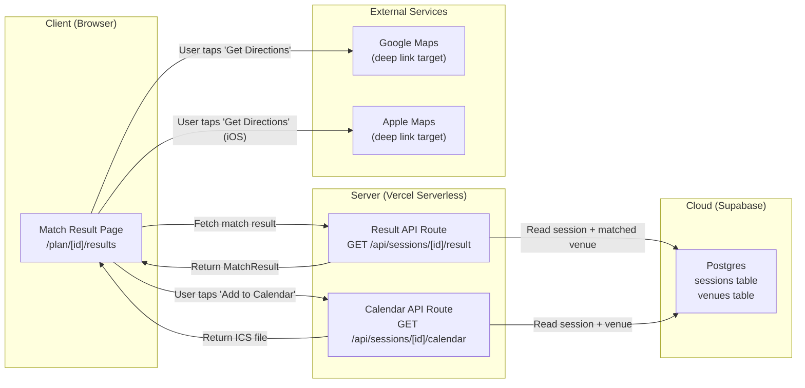
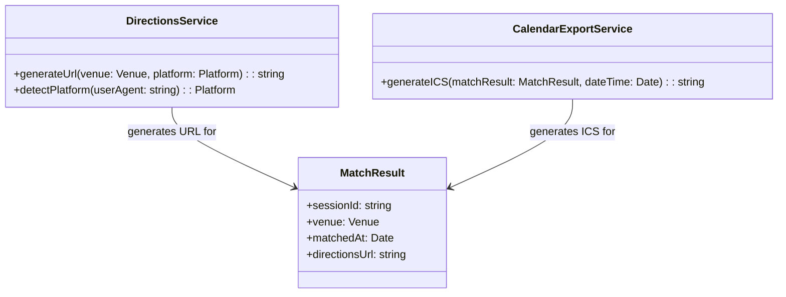
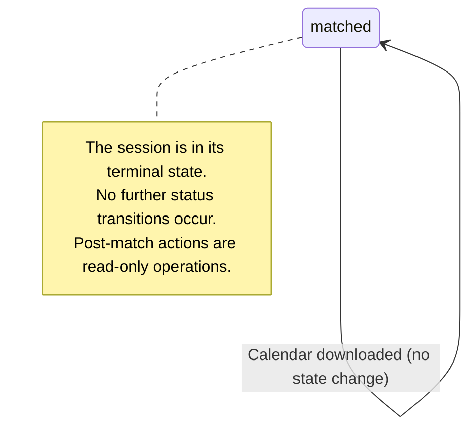
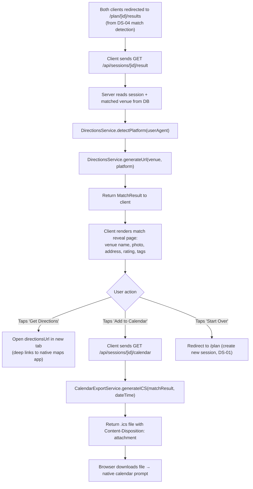

# DS-05 — Post-Match Actions

**Type:** Dependent
**Depends on:** DS-04 (Swipe & Match System) — requires a matched session with a `matched_venue_id` before any post-match action can be taken
**Depended on by:** Nothing (terminal spec in the main chain)
**User Stories:** US-08 (Get directions to matched venue), US-09 (Add date to calendar)

---

## Architecture Diagram



**Where components run:**
- **Client:** Browser — renders the match result page, triggers deep links and file downloads
- **Server:** Vercel serverless — assembles the MatchResult from DB, generates ICS files on demand
- **Cloud:** Supabase Postgres — source of truth for session and venue data
- **External:** Google Maps / Apple Maps are deep link targets only (no API calls from Dateflow)

**Information flows:**
- Client → Server: request for match result (session ID) or calendar file (session ID)
- Server → Cloud: read session row + matched venue row
- Server → Client: MatchResult JSON (result endpoint) or ICS file bytes (calendar endpoint)
- Client → External: deep link URL opens native maps app on user's device

---

## Class Diagram



---

## List of Classes

### MatchResult
**Type:** Entity
**Purpose:** Represents the finalized result of a matched session. Combines the matched venue's full details with session metadata. This is the data structure that the result page renders.
**Key fields:** `sessionId` (string), `venue` (Venue from DS-03), `matchedAt` (Date — when the match was detected), `directionsUrl` (string — pre-generated deep link to maps)

### DirectionsService
**Type:** Service
**Purpose:** Generates platform-appropriate deep links to map applications. On iOS, generates an Apple Maps link. On Android and desktop, generates a Google Maps link. Uses the venue's address for the destination.
**Key methods:**
- `generateUrl(venue, platform)` — returns a URL string. Google Maps format: `https://www.google.com/maps/dir/?api=1&destination={encoded_address}`. Apple Maps format: `https://maps.apple.com/?daddr={encoded_address}`.
- `detectPlatform(userAgent)` — parses the User-Agent header to determine if the client is iOS, Android, or desktop.

### CalendarExportService
**Type:** Service
**Purpose:** Generates an ICS (iCalendar) file for the matched date. The file contains the venue name, address, and date/time. When downloaded, it triggers the device's native calendar add flow (Google Calendar, Apple Calendar, Outlook, etc.).
**Key methods:** `generateICS(matchResult, dateTime)` — returns a string in ICS format. The `dateTime` parameter is the user's selected date/time from their availability preferences (DS-02). If no specific time was set, defaults to 7:00 PM on the next available day.

---

## State Diagram



DS-05 does not introduce new session states. The session remains in `matched` status. All actions in this spec are read-only — they consume the match result but do not alter session state.

---

## Flow Chart



---

## Development Risks and Failures

| Risk | Impact | Mitigation |
|---|---|---|
| iOS Safari blocks the ICS download as a popup | Calendar export fails silently on the most common mobile browser | Serve the ICS file as a direct download with correct `Content-Type: text/calendar` and `Content-Disposition: attachment`. Test on iOS Safari specifically before launch. |
| Google Maps deep link opens in browser instead of the native app | Worse UX on Android, user must manually switch to app | Use the `comgooglemaps://` scheme as primary with `https://www.google.com/maps/` as fallback. Test on Android Chrome. |
| Venue data has changed since generation (closed, moved, etc.) | User shows up to a closed venue | Add a "last verified" note with the generation timestamp. Phase 2: re-verify venue status via Places API when the result page is loaded. |
| User wants to share the result with their match | No built-in sharing mechanism for the result | Both users see the same result page at `/plan/[id]/results`. The URL is already shareable. Add "Share this plan" button that copies the URL. |

---

## Technology Stack

| Component | Technology | Justification |
|---|---|---|
| Result page | React Server Component (Next.js) | SSR for fast load, good link preview (Open Graph) |
| ICS generation | ical.js (npm package) | Mature library for generating valid ICS files |
| Platform detection | User-Agent parsing (server-side) | Determines Google Maps vs Apple Maps deep link |
| File download | Next.js API route with stream response | Serves ICS as downloadable file |

---

## APIs

### GET /api/sessions/[id]/result
**Purpose:** Retrieve the match result with full venue details and directions URL.
**Auth:** None.
**Rate limit:** 30 per IP per minute.
**Response (200):**
```json
{
  "matchResult": {
    "sessionId": "a1b2c3d4-...",
    "venue": {
      "id": "c3d4e5f6-...",
      "placeId": "ChIJ...",
      "name": "Whisler's",
      "category": "BAR",
      "address": "1816 E 6th St, Austin, TX",
      "priceLevel": 2,
      "rating": 4.5,
      "photoUrl": "https://maps.googleapis.com/...",
      "tags": ["conversation-friendly", "outdoor-patio", "walkable"]
    },
    "matchedAt": "2026-03-27T12:15:00Z",
    "directionsUrl": "https://www.google.com/maps/dir/?api=1&destination=1816+E+6th+St+Austin+TX"
  }
}
```
**Error responses:**
- 404: Session not found
- 409: Session not in `matched` status

### GET /api/sessions/[id]/calendar
**Purpose:** Download an ICS calendar file for the matched date.
**Auth:** None.
**Rate limit:** 10 per IP per minute.
**Query params:** `dateTime` (optional ISO 8601 string — if omitted, defaults to 7:00 PM on the next day)
**Response (200):**
- `Content-Type: text/calendar; charset=utf-8`
- `Content-Disposition: attachment; filename="dateflow-plan.ics"`
- Body: valid ICS file content

**Error responses:**
- 404: Session not found
- 409: Session not in `matched` status

---

## Public Interfaces

### DirectionsService Interface
```typescript
type Platform = 'ios' | 'android' | 'desktop';

interface IDirectionsService {
  generateUrl(venue: Venue, platform: Platform): string;
  detectPlatform(userAgent: string): Platform;
}
```

### CalendarExportService Interface
```typescript
interface ICalendarExportService {
  generateICS(matchResult: MatchResult, dateTime: Date): string;
}
```

### MatchResult Type
```typescript
type MatchResult = {
  readonly sessionId: string;
  readonly venue: Venue;
  readonly matchedAt: Date;
  readonly directionsUrl: string;
};
```

---

## Data Schemas

DS-05 does not introduce new database tables. It reads from existing tables:
- `sessions` (DS-01) — to verify `status = 'matched'` and get `matched_venue_id`
- `venues` (DS-03) — to load the matched venue's full details

### ICS File Schema
```
BEGIN:VCALENDAR
VERSION:2.0
PRODID:-//Dateflow//EN
BEGIN:VEVENT
DTSTART:20260328T190000Z
DTEND:20260328T210000Z
SUMMARY:Date at Whisler's
LOCATION:1816 E 6th St, Austin, TX
DESCRIPTION:Planned with Dateflow — https://dateflow.app/plan/{sessionId}/results
END:VEVENT
END:VCALENDAR
```

---

## Security and Privacy

- **No new PII introduced.** The result page displays venue data (public information), not user data.
- **ICS file contains no user-identifiable data.** The calendar event includes the venue name, address, and a link back to the result page — no names, emails, or phone numbers.
- **Deep links do not expose API keys.** Directions URLs use the public Google Maps / Apple Maps link format, not API endpoints.
- **Result page access is open.** Anyone with the session ID can view the result. This is intentional — both users need access without authentication. The session ID's UUID randomness provides security-through-obscurity appropriate for the MVP's threat model.

---

## Risks to Completion

| Risk | Probability | Impact | Mitigation |
|---|---|---|---|
| ICS formatting edge cases across calendar apps | Medium | Low — minor display issues in some calendars | Test against Google Calendar, Apple Calendar, and Outlook. Use ical.js which handles most edge cases. |
| Match result page feels anticlimactic | Medium | Medium — the emotional peak of the product falls flat | Invest in the reveal animation. Consider confetti, a brief summary of "why this matched," and a clear "you both picked this" message. |
| Open Graph link previews don't render on share | Low | Low — the share link works but looks plain in iMessage/WhatsApp | Set appropriate `og:title`, `og:description`, and `og:image` meta tags on the result page. Use the venue photo as the OG image. |
