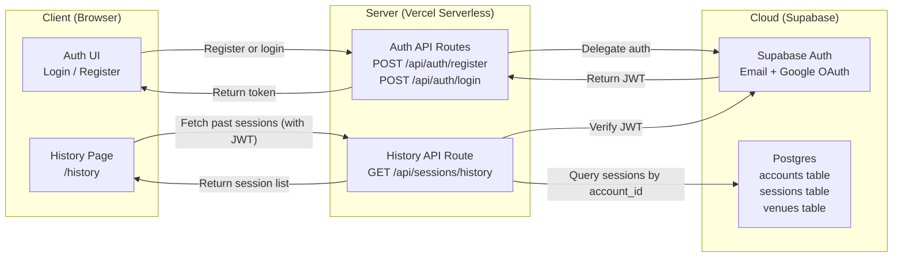
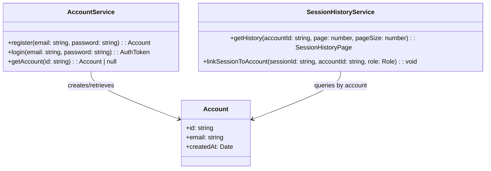
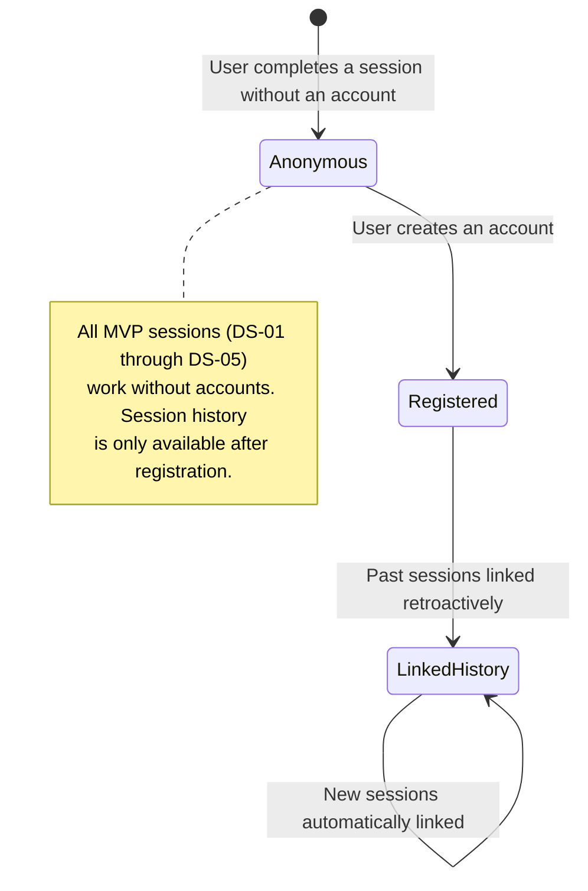
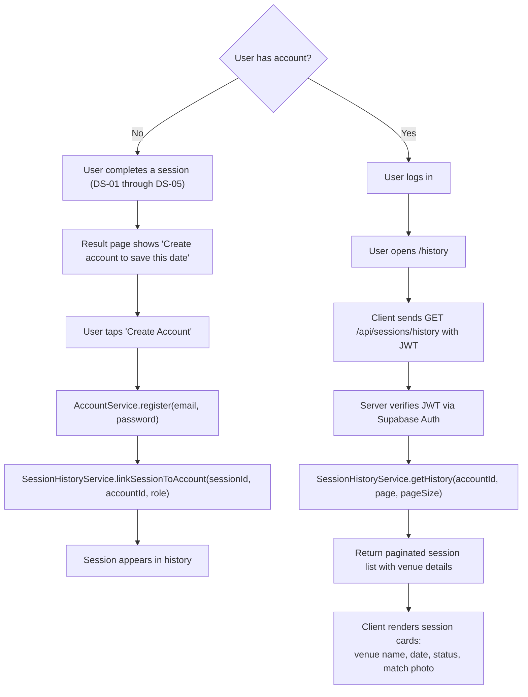

# DS-06 — Session History

**Type:** Dependent
**Depends on:** DS-01 (Session Management) — requires sessions to exist; operates independently of the DS-02 → DS-05 chain
**Depended on by:** Nothing
**User Stories:** US-14 (View past sessions)

**Relationship to main chain:** DS-06 branches off from DS-01 and is fully independent of DS-02 through DS-05. It can be built and deployed at any time after DS-01, without waiting for venue generation or swiping to be complete. However, session history is most valuable when sessions have progressed to `matched` status (via DS-04), so it is sequenced as a Phase 2 feature.

---

## Architecture Diagram



**Where components run:**
- **Client:** Browser — authentication forms and session history list view
- **Server:** Vercel serverless — auth route handlers and history query endpoint
- **Cloud:** Supabase Auth (managed authentication with JWT), Supabase Postgres (account and session data)

**Information flows:**
- Client → Server: registration/login credentials, JWT token for authenticated requests
- Server → Cloud: delegate authentication to Supabase Auth, query sessions joined by the account's ID
- Server → Client: JWT on auth success, paginated list of past sessions on history request

---

## Class Diagram



---

## List of Classes

### Account
**Type:** Entity
**Purpose:** A lightweight user account. Introduced in Phase 2 specifically to enable session history. The MVP flow (DS-01 through DS-05) works without accounts. An account is optional and can be created retroactively after completing a session.
**Key fields:** `id` (UUID, matches Supabase Auth user ID), `email`, `createdAt`

### AccountService
**Type:** Service
**Purpose:** Wraps Supabase Auth for account registration and login. Returns JWTs for authenticated API access.
**Key methods:**
- `register(email, password)` — creates a Supabase Auth user and an `accounts` row. Returns the Account.
- `login(email, password)` — authenticates via Supabase Auth, returns an AuthToken (JWT).
- `getAccount(id)` — retrieves account by ID. Returns null if not found.

### SessionHistoryService
**Type:** Service
**Purpose:** Retrieves a paginated list of past sessions associated with an account. Sessions are linked to accounts when the user creates an account (or logs in) after completing a session.
**Key methods:**
- `getHistory(accountId, page, pageSize)` — queries sessions linked to the account, sorted by `created_at` descending. Returns a page of sessions with their matched venue details (if the session reached `matched` status).
- `linkSessionToAccount(sessionId, accountId, role)` — associates a session with an account. Called when a user creates an account after completing a session, or when a logged-in user starts/joins a session. Uses the `session_accounts` join table.

---

## State Diagram



DS-06 does not affect session status transitions. The state diagram above describes the account lifecycle, not the session lifecycle.

---

## Flow Chart



---

## Development Risks and Failures

| Risk | Impact | Mitigation |
|---|---|---|
| Users don't create accounts (low conversion from anonymous to registered) | Session history feature is unused, development effort wasted | Make account creation frictionless — offer Google OAuth one-tap. Delay account prompt until the user has had a successful match (moment of highest engagement). Don't gate core functionality behind accounts. |
| Retroactive session linking fails (user creates account but can't find their old sessions) | User frustration, perceived data loss | Store a local session ID in `localStorage` during the session. On account creation, submit this ID for linking. If localStorage is cleared, the session is lost — acceptable trade-off for MVP. |
| Session history shows expired/failed sessions that are confusing | User sees "expired" sessions they don't remember | Only show sessions that reached `matched` status in the default view. Add a "Show all" toggle for power users who want full history. |
| Account data adds GDPR/privacy complexity | Legal compliance burden, data deletion requests | Implement account deletion endpoint from day one. Cascade delete: removing an account removes all `session_accounts` links (but does not delete shared sessions, only the user's link to them). |

---

## Technology Stack

| Component | Technology | Justification |
|---|---|---|
| Authentication | Supabase Auth (email + Google OAuth) | Managed auth with JWT, no custom auth infrastructure |
| JWT verification | @supabase/ssr | Server-side JWT verification in Next.js API routes |
| History UI | React Server Component (Next.js) | Paginated list with SSR for fast initial load |
| Local session storage | localStorage | Stores session ID for retroactive account linking |

---

## APIs

### POST /api/auth/register
**Purpose:** Create a new account.
**Auth:** None (this creates the account).
**Rate limit:** 3 per IP per hour.
**Request body:**
```json
{
  "email": "user@example.com",
  "password": "securepassword123",
  "linkSessionId": "a1b2c3d4-...",
  "linkRole": "a"
}
```
**Validation rules:**
- `email` must be a valid email format
- `password` must be at least 8 characters
- `linkSessionId` is optional — if provided, links this session to the new account
- `linkRole` is required if `linkSessionId` is provided, must be `"a"` or `"b"`

**Response (201):**
```json
{
  "account": {
    "id": "e5f6g7h8-...",
    "email": "user@example.com",
    "createdAt": "2026-03-27T12:20:00Z"
  },
  "token": "eyJhbGciOiJIUzI1NiIs..."
}
```
**Error responses:**
- 400: Validation failed
- 409: Email already registered
- 429: Rate limit exceeded

### POST /api/auth/login
**Purpose:** Authenticate and receive a JWT.
**Auth:** None (this authenticates the user).
**Rate limit:** 10 per IP per minute.
**Request body:**
```json
{
  "email": "user@example.com",
  "password": "securepassword123"
}
```
**Response (200):**
```json
{
  "account": {
    "id": "e5f6g7h8-...",
    "email": "user@example.com",
    "createdAt": "2026-03-27T12:20:00Z"
  },
  "token": "eyJhbGciOiJIUzI1NiIs..."
}
```
**Error responses:**
- 401: Invalid credentials
- 429: Rate limit exceeded

### GET /api/sessions/history
**Purpose:** List past sessions for the authenticated user.
**Auth:** JWT required (Bearer token in Authorization header).
**Rate limit:** 20 per IP per minute.
**Query params:**
- `page` (optional, default 1)
- `pageSize` (optional, default 10, max 50)

**Response (200):**
```json
{
  "sessions": [
    {
      "sessionId": "a1b2c3d4-...",
      "status": "matched",
      "createdAt": "2026-03-27T12:00:00Z",
      "matchedVenue": {
        "name": "Whisler's",
        "category": "BAR",
        "address": "1816 E 6th St, Austin, TX",
        "photoUrl": "https://maps.googleapis.com/..."
      },
      "role": "a"
    }
  ],
  "page": 1,
  "pageSize": 10,
  "totalCount": 3,
  "totalPages": 1
}
```
**Error responses:**
- 401: Missing or invalid JWT
- 429: Rate limit exceeded

---

## Public Interfaces

### AccountService Interface
```typescript
type AuthToken = {
  readonly token: string;
  readonly expiresAt: Date;
};

interface IAccountService {
  register(email: string, password: string): Promise<Account>;
  login(email: string, password: string): Promise<AuthToken>;
  getAccount(id: string): Promise<Account | null>;
}
```

### SessionHistoryService Interface
```typescript
type SessionHistoryEntry = {
  readonly sessionId: string;
  readonly status: SessionStatus;
  readonly createdAt: Date;
  readonly matchedVenue: {
    readonly name: string;
    readonly category: Category;
    readonly address: string;
    readonly photoUrl: string | null;
  } | null;
  readonly role: Role;
};

type SessionHistoryPage = {
  readonly sessions: readonly SessionHistoryEntry[];
  readonly page: number;
  readonly pageSize: number;
  readonly totalCount: number;
  readonly totalPages: number;
};

interface ISessionHistoryService {
  getHistory(accountId: string, page: number, pageSize: number): Promise<SessionHistoryPage>;
  linkSessionToAccount(sessionId: string, accountId: string, role: Role): Promise<void>;
}
```

### Account Type
```typescript
type Account = {
  readonly id: string;
  readonly email: string;
  readonly createdAt: Date;
};
```

---

## Data Schemas

### accounts table
```sql
CREATE TABLE accounts (
  id          uuid PRIMARY KEY,  -- matches Supabase Auth user ID
  email       text NOT NULL UNIQUE,
  created_at  timestamptz NOT NULL DEFAULT now()
);
```

### session_accounts join table
```sql
CREATE TABLE session_accounts (
  session_id  uuid NOT NULL REFERENCES sessions(id) ON DELETE CASCADE,
  account_id  uuid NOT NULL REFERENCES accounts(id) ON DELETE CASCADE,
  role        text NOT NULL CHECK (role IN ('a', 'b')),
  linked_at   timestamptz NOT NULL DEFAULT now(),
  PRIMARY KEY (session_id, account_id)
);

CREATE INDEX idx_session_accounts_account ON session_accounts (account_id);
```

### Modified sessions table (no schema change)
The `sessions` table (DS-01) is not modified. The relationship between accounts and sessions is managed entirely through the `session_accounts` join table. This preserves the MVP's accountless flow.

---

## Security and Privacy

- **JWT authentication required for history.** All history endpoints verify the JWT via Supabase Auth. No session data is accessible without a valid token.
- **Account-scoped data access.** `getHistory` queries only sessions linked to the authenticated account's ID. Row-level security (RLS) in Supabase enforces this at the DB level as a defense-in-depth measure.
- **Password security delegated to Supabase Auth.** Supabase uses bcrypt for password hashing. No custom password storage.
- **Account deletion cascade.** Deleting an account removes all `session_accounts` links. The sessions themselves are not deleted (they belong to both participants), but the deleted user can no longer access them.
- **Rate limiting on auth endpoints.** Registration (3/hr) and login (10/min) prevent brute force and credential stuffing attacks.
- **No email verification in MVP.** Supabase Auth supports email verification but it is deferred to Phase 3 to minimize friction. The trade-off is that accounts can be created with fake emails — acceptable at MVP scale.

---

## Risks to Completion

| Risk | Probability | Impact | Mitigation |
|---|---|---|---|
| Supabase Auth integration complexity | Low | Medium — auth is well-documented but config-heavy | Follow Supabase's Next.js auth guide exactly. Use @supabase/ssr for server-side JWT verification. |
| localStorage session ID cleared before account creation | Medium | Low — user loses the ability to link that session retroactively | Accept this trade-off for MVP. Phase 3: use a device fingerprint as a secondary linking mechanism. |
| Low account creation rate makes history feature low-impact | High | Low — the feature is Phase 2 and low-cost to build | Track account creation rate in PostHog. If under 5%, consider removing accounts entirely and using cookie-based anonymous history instead. |
| GDPR data deletion requests | Low (at MVP scale) | Medium — must handle correctly | Build account deletion endpoint from day one. Test cascade delete behavior before launch. |
