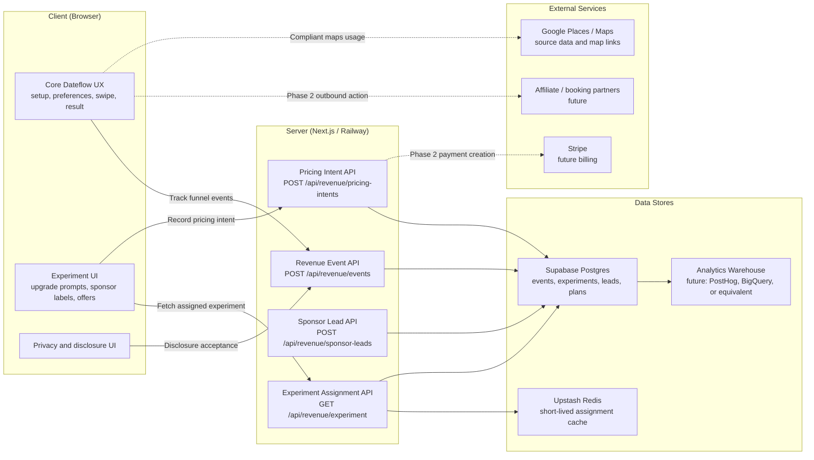
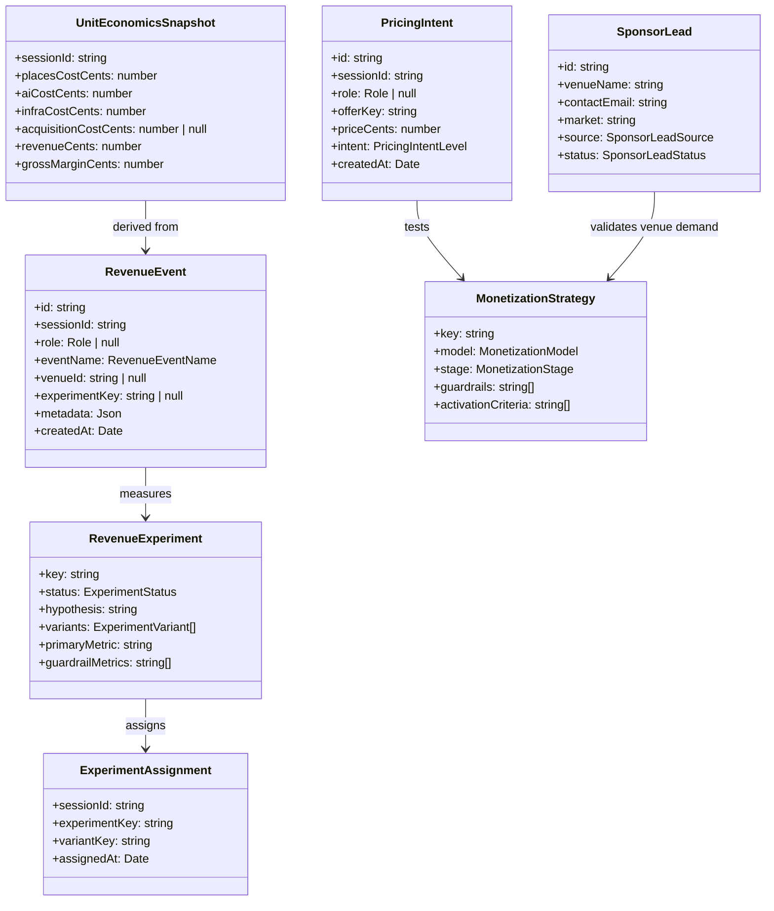
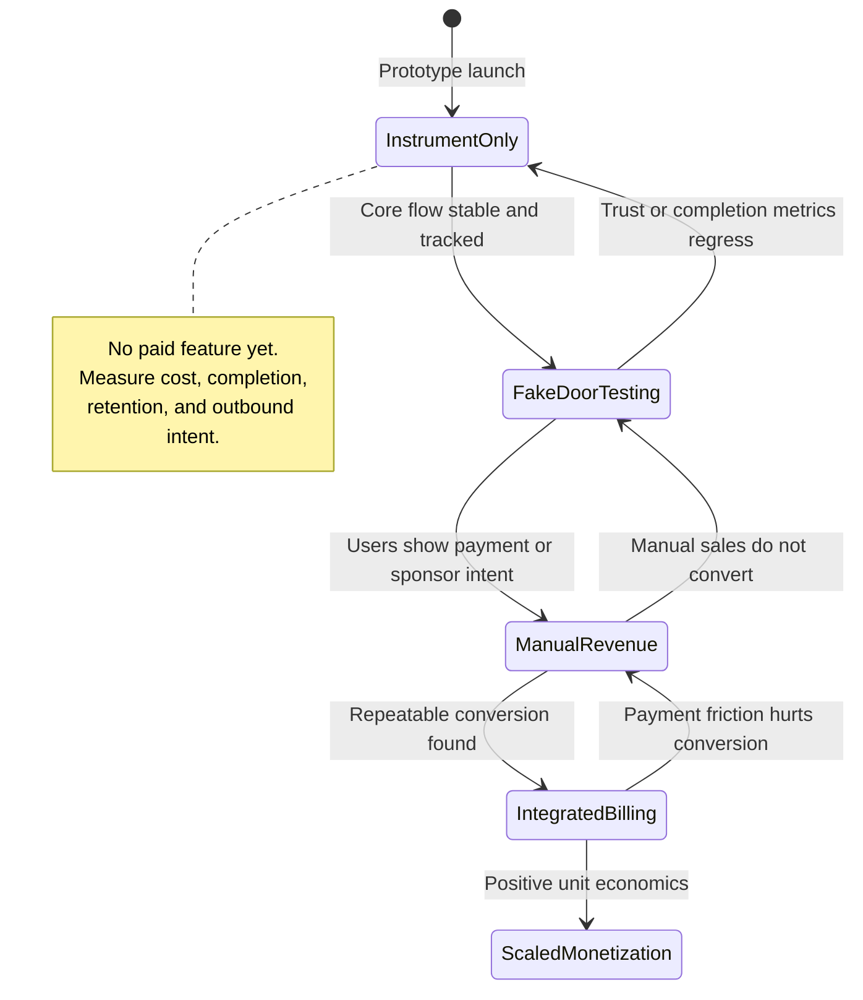
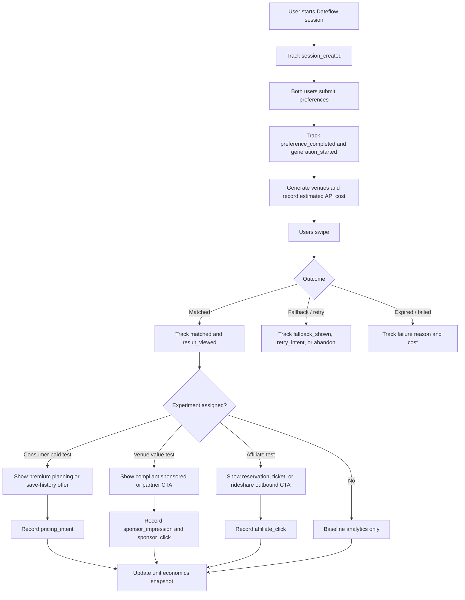

# DS-07 - Monetization & Revenue Intelligence

**Type:** Strategic / Supplemental
**Depends on:** DS-01 through DS-05 for the core planning loop, DS-06 for account-linked history and retention analysis
**Depended on by:** Future paid experiments, venue partnerships, affiliate integrations, premium user features, investor-facing unit economics
**User Stories:** US-15 (Measure willingness to pay), US-16 (Track venue conversion intent), US-17 (Evaluate sponsor fit without degrading trust), US-18 (Understand acquisition and usage economics)
**Goal:** Define how Dateflow should learn which monetization paths are viable before and immediately after prototype release, without compromising the product promise that both users receive trustworthy first-date recommendations.

---

## Why This Exists

Dateflow is close to a prototype release. The core product can create a session, collect preferences, generate venues, support private swiping, and reveal a shared plan. That is enough to start learning whether people find the service valuable.

It is not enough to know how the business makes money.

This spec defines the data, experiments, guardrails, and future architecture needed to answer the monetization question deliberately. The first version should not force a revenue model too early. It should instrument the product so we can compare real usage against the cost to serve each session, then run small experiments that test willingness to pay, sponsor demand, and venue conversion value.

The product should avoid three mistakes:

- Monetizing too early in a way that damages trust.
- Waiting too long to measure revenue intent and discovering the unit economics do not work.
- Building a sponsor marketplace before proving that Dateflow creates measurable venue demand.

---

## Monetization Thesis

Dateflow can monetize if it proves at least one of these value exchanges:

1. **Consumer value:** users will pay for better date planning, better coordination, saved history, premium venue curation, or reduced planning friction.
2. **Venue value:** venues will pay for qualified date-night demand when placement is transparent and does not corrupt matching quality.
3. **Affiliate value:** booking, reservation, rideshare, events, ticketing, or local experience partners will pay for downstream actions.
4. **Data value:** aggregated, privacy-safe insights about date intent can guide product and partnership decisions. This should support the business, not become a standalone data resale product for the MVP.

The near-term goal is not to maximize revenue. The near-term goal is to learn which value exchange has the best combination of:

- user trust
- conversion rate
- implementation cost
- legal and platform compliance
- gross margin after API, hosting, AI, and acquisition costs
- repeat usage potential

---

## Non-Goals

- Do not sell personal user data.
- Do not hide paid placements inside organic recommendations.
- Do not let paid placements override hard safety, distance, budget, or category constraints.
- Do not build a full venue self-serve ad platform before proving sponsor demand manually.
- Do not require payment for the core prototype flow before retention and match completion rates are known.
- Do not prefetch or cache Google Places content in ways that violate Google Maps Platform terms.

---

## Architecture Diagram



**Where components run:**
- **Client:** renders experiment prompts, sponsor labels, and optional offer CTAs inside the existing flow.
- **Server:** assigns experiments, validates events, stores sponsor interest, and eventually creates payment or affiliate intents.
- **Data stores:** keep a durable event trail for unit economics, funnel analysis, and revenue experiment outcomes.
- **External services:** remain optional until the prototype produces enough demand signal to justify integration cost.

**Information flows:**
- Client sends revenue and funnel events with session-scoped identifiers, not raw personal identity.
- Server stores normalized events tied to session, role, experiment, and venue where applicable.
- Analytics aggregates session economics, conversion rates, sponsor exposure, and user trust metrics.
- Future paid flows call Stripe or affiliate partners only after product-market and legal guardrails are validated.

---

## Class Diagram



---

## List of Classes

### RevenueEvent
**Type:** Entity
**Purpose:** A normalized event used to measure the monetization funnel and unit economics. Events should be specific enough to answer business questions, but not so broad that every click becomes noisy.
**Key fields:** `id`, `sessionId`, `role`, `eventName`, `venueId`, `experimentKey`, `variantKey`, `metadata`, `createdAt`

### RevenueExperiment
**Type:** Entity
**Purpose:** Defines one monetization learning test. Each experiment must have a hypothesis, explicit variants, a primary metric, and guardrail metrics that protect trust and core conversion.
**Key fields:** `key`, `status`, `hypothesis`, `variants`, `primaryMetric`, `guardrailMetrics`, `startAt`, `endAt`

### ExperimentAssignment
**Type:** Entity
**Purpose:** Stores deterministic assignment of a session to a variant. Assignment must be stable for both users in the same session unless the experiment is role-specific.
**Key fields:** `sessionId`, `experimentKey`, `variantKey`, `assignedAt`

### MonetizationStrategy
**Type:** Value Object
**Purpose:** A structured description of a revenue model being evaluated. This keeps strategy decisions explicit instead of scattering assumptions across product code.
**Key fields:** `key`, `model`, `stage`, `expectedBuyer`, `valueProposition`, `activationCriteria`, `guardrails`

### PricingIntent
**Type:** Entity
**Purpose:** Captures willingness-to-pay signals before real billing is introduced. This can record clicks on "upgrade", email capture for paid plans, fake-door pricing tests, or completed payments once Stripe is active.
**Key fields:** `id`, `sessionId`, `role`, `offerKey`, `priceCents`, `intent`, `metadata`, `createdAt`

### SponsorLead
**Type:** Entity
**Purpose:** Tracks venue-side monetization interest before building a full sponsor marketplace. Early sponsor validation should be manual and market-specific.
**Key fields:** `id`, `venueName`, `googlePlaceId`, `contactEmail`, `market`, `source`, `status`, `notes`, `createdAt`

### UnitEconomicsSnapshot
**Type:** Derived View
**Purpose:** Computes approximate profit or loss per completed session. This should include API costs, AI costs, hosting estimates, acquisition estimates, and realized or projected revenue.
**Key fields:** `sessionId`, `placesCostCents`, `aiCostCents`, `infraCostCents`, `acquisitionCostCents`, `revenueCents`, `grossMarginCents`

---

## State Diagram



**State meanings:**
- `InstrumentOnly`: collect baseline funnel and cost data without asking for money.
- `FakeDoorTesting`: show controlled pricing or sponsor prompts without charging, then measure intent.
- `ManualRevenue`: close early venue or affiliate partnerships manually.
- `IntegratedBilling`: add Stripe or partner integrations for proven offers.
- `ScaledMonetization`: optimize pricing, marketplace supply, and paid acquisition only after positive unit economics.

---

## Flow Chart



---

## Monetization Models

### Model A: Consumer Premium

**Buyer:** one or both users planning the date.

**Possible offers:**
- Save unlimited date history.
- Premium "date concierge" flow with richer explanations, timing, and backup venues.
- Special occasion planning, such as anniversaries, birthdays, or proposal-adjacent events.
- Advanced filters, such as quieter places, dietary needs, accessibility, live music, reservations, and neighborhood constraints.
- Pay-per-plan upgrade after a match, for example "build a full evening around this venue."

**Why it might work:**
- The emotional moment is strongest after a match.
- Users may pay to reduce uncertainty before meeting someone.
- Consumer pricing keeps recommendations independent from venues.

**Why it might fail:**
- Dating users are often price-sensitive.
- The product may feel like a lightweight utility, not a paid planning service.
- Payment before proven retention can reduce sharing and completion.

**Prototype test:**
- Fake-door CTA on result page: "Upgrade this into a full date plan."
- Capture click, selected price point, email, and whether the user completed the rest of the result actions.
- Do not block directions or calendar behind payment during prototype.

**Activation criteria:**
- At least 8 to 12 percent of matched sessions click an upgrade CTA.
- At least 3 to 5 percent leave email or payment intent.
- No meaningful drop in result-page directions clicks or share behavior.

### Model B: Venue Sponsored Boosts

**Buyer:** local venues that want qualified first-date traffic.

**Possible offers:**
- Transparent sponsored inclusion inside candidate generation.
- Sponsored fallback suggestion after no mutual match.
- Venue profile page or "why this is good for a first date" enhancement.
- Market launch packages for specific neighborhoods.

**Required guardrails:**
- Paid venues must still pass safety, distance, category, price, rating, and availability rules.
- Sponsored placements must be labeled clearly.
- Paid placement cannot guarantee a match or override user preference ranking.
- Dateflow must not imply that organic recommendations are paid.

**Why it might work:**
- First-date traffic is commercially valuable for bars, restaurants, activities, and events.
- Dateflow can eventually prove high-intent impressions, not generic ad views.
- Venue sales can start manually before building a marketplace.

**Why it might fail:**
- Users may lose trust if recommendations feel bought.
- Small venues are difficult to sell to at scale.
- Google Places content policies can constrain how venue data is stored and reused.

**Prototype test:**
- Start with internal "sponsor simulation" using non-paid test venues or manually approved partners.
- Measure sponsor impression, swipe-like rate, result conversion, and complaint or hide actions.
- Interview local venues with a mock report showing potential metrics.

**Activation criteria:**
- Sponsored candidates perform within 10 percent of organic candidates on like rate.
- Users understand the label in qualitative tests.
- At least 5 local venues agree to a paid or letter-of-intent pilot in one market.

### Model C: Affiliate and Booking Revenue

**Buyer:** downstream partner paying for booking, reservation, ticket, or rideshare action.

**Possible partners:**
- Reservation platforms.
- Event ticketing platforms.
- Rideshare or transit partners.
- Experience marketplaces.
- Florists, gifts, or post-match add-ons.

**Why it might work:**
- Fits naturally after a match.
- Does not require charging users directly.
- Can be tested with outbound click tracking before full integration.

**Why it might fail:**
- Affiliate payouts may be too low for a low-frequency product.
- Partner coverage can be inconsistent by city and venue type.
- Deep integrations can create maintenance cost before revenue is proven.

**Prototype test:**
- Track result-page outbound clicks by action type: directions, reservation, ticket, rideshare, website.
- Use manually configured links for a small number of venues or event providers.
- Compare partner-click conversion against session cost.

**Activation criteria:**
- At least 20 to 30 percent of matched sessions click a commercial outbound action.
- Expected revenue per completed session exceeds variable API and AI cost.
- Partner coverage is strong enough in the launch market to avoid broken UX.

### Model D: Venue Insights and Dashboard

**Buyer:** venue owners or local operators.

**Possible offers:**
- Aggregate demand trends, such as date-night category demand by neighborhood.
- Sponsor performance reports.
- Profile optimization suggestions.
- Competitive benchmark inside a local date-night market.

**Why it might work:**
- Higher B2B willingness to pay than consumer.
- Builds on sponsor metrics if Dateflow sends measurable demand.

**Why it should wait:**
- Requires enough volume to be credible.
- Can become privacy-sensitive if built too early.
- Dashboard work is expensive and distracts from core demand generation.

**Prototype test:**
- Manual monthly PDF or email report for pilot venues.
- No self-serve dashboard until at least one venue pays for the report or sponsored placement.

---

## Recommended Monetization Sequence

### Phase 0: Instrument Before Charging

**Timing:** immediately before prototype release.

**Build:**
- Revenue event taxonomy.
- Cost-per-session tracking.
- Result-page outbound intent tracking.
- Experiment assignment framework.
- Basic admin export for analysis.

**Do not build yet:**
- Stripe checkout.
- Sponsor marketplace.
- Affiliate partner integrations.
- Venue dashboards.

**Primary question:** What does a completed session cost, and where do users show commercial intent?

### Phase 1: Fake-Door Revenue Tests

**Timing:** after core flow has stable completion and generation reliability.

**Build:**
- Non-blocking premium CTA on result page.
- Non-blocking reservation or "book this" outbound intent CTA.
- Optional account-history premium prompt.
- Sponsor disclosure copy tests with internal simulated sponsor candidates.

**Primary question:** Which monetization surface gets intent without hurting match completion or trust?

### Phase 2: Manual Revenue Pilots

**Timing:** after one or two fake-door tests produce meaningful intent.

**Build:**
- Manual sponsor lead workflow.
- Manual partner link configuration.
- Simple revenue attribution ledger.
- Pilot reporting for venues.

**Primary question:** Will a venue or partner pay for the demand Dateflow can create?

### Phase 3: Integrated Monetization

**Timing:** only after manual pilots produce revenue or strong letters of intent.

**Build:**
- Stripe checkout for consumer premium or venue pilots.
- Partner link routing and attribution.
- Sponsor eligibility and ranking constraints.
- Admin controls for sponsored placement review.

**Primary question:** Can Dateflow generate positive gross margin while preserving user trust?

---

## Metrics

### Core Funnel Metrics

| Metric | Why it matters |
|---|---|
| `session_created` | Top of funnel |
| `person_a_preferences_completed` | Setup friction |
| `person_b_joined` | Invite/share effectiveness |
| `person_b_preferences_completed` | Partner conversion |
| `generation_started` | Supply pipeline entry |
| `generation_succeeded` | Reliability |
| `generation_failed` | Cost without value |
| `swipe_started` | Engagement |
| `round_completed` | Swipe quality and flow completion |
| `matched` | Primary product success |
| `fallback_shown` | No-match path frequency |
| `result_viewed` | Result delivery |
| `directions_clicked` | Real-world intent |
| `calendar_clicked` | Planning commitment |

### Revenue Intent Metrics

| Metric | Why it matters |
|---|---|
| `premium_offer_viewed` | Offer exposure |
| `premium_offer_clicked` | Consumer willingness signal |
| `pricing_intent_submitted` | Stronger willingness signal |
| `sponsor_impression` | Paid supply exposure |
| `sponsor_disclosure_viewed` | Compliance and comprehension |
| `sponsor_clicked` | Venue demand signal |
| `affiliate_offer_clicked` | Partner revenue signal |
| `reservation_clicked` | High-value commercial action |
| `venue_website_clicked` | Venue demand proxy |
| `sponsor_lead_created` | B2B pipeline |

### Trust Guardrail Metrics

| Metric | Failure signal |
|---|---|
| Swipe like rate by organic vs sponsored | Sponsored quality is weaker |
| Result-page bounce rate | Monetization prompt harms result experience |
| Directions click rate | Users trust the matched venue less |
| Retry or fallback rate | Venue quality is declining |
| Explicit "not interested" or hide action | Offer is intrusive |
| Session completion rate | Monetization disrupts core flow |

### Unit Economics Metrics

| Metric | Notes |
|---|---|
| Places search cost per session | Includes Nearby Search, Text Search, Place Details, and photos where used |
| Photo cost per session | Track separately because photo/details usage can dominate variable cost |
| AI curation cost per session | Include provider, model, tokens, fallback rate |
| Infrastructure cost estimate | Railway, Supabase, Upstash, background jobs |
| Acquisition cost per activated session | Initially manual estimate until paid acquisition starts |
| Revenue per completed session | Consumer, sponsor, affiliate, or blended |
| Gross margin per completed session | Revenue minus variable serving cost |

---

## Experiment Backlog

### Experiment 1: Premium Result Upgrade

**Hypothesis:** After a match, users are willing to pay for a richer plan because the product has already delivered value.

**Variants:**
- Control: no premium prompt.
- Variant A: "Make this a full date plan" at $3.
- Variant B: "Make this a full date plan" at $5.
- Variant C: email waitlist for premium date concierge.

**Primary metric:** `premium_offer_clicked / result_viewed`

**Guardrails:**
- Directions click rate must not drop.
- Calendar click rate must not drop.
- Result-page bounce must not increase materially.

### Experiment 2: Save History Paywall Probe

**Hypothesis:** Users who complete a match care about remembering or reusing date plans.

**Variants:**
- Control: free account prompt.
- Variant A: free history plus premium "favorites and notes" waitlist.
- Variant B: premium "save unlimited date plans" fake door.

**Primary metric:** account creation or email capture after match.

**Guardrails:**
- Do not block access to the result.
- Do not add account friction before both users complete the core flow.

### Experiment 3: Sponsored Venue Disclosure Comprehension

**Hypothesis:** Users will tolerate sponsored venues if they are clearly labeled and still fit preferences.

**Variants:**
- Control: organic ranking only.
- Variant A: sponsored label in card metadata.
- Variant B: sponsored label plus "still matched to your preferences" explanation.

**Primary metric:** comprehension in user testing, then swipe like rate once live.

**Guardrails:**
- Sponsored candidates must pass all organic eligibility filters.
- Label must be visible before the user swipes.
- Sponsored candidates must not fill more than one slot per round in early tests.

### Experiment 4: Reservation / Booking Intent

**Hypothesis:** Matched users want to take a next step immediately from the result page.

**Variants:**
- Control: directions and calendar only.
- Variant A: "Reserve a table" link where available.
- Variant B: "Open venue website" link.
- Variant C: "Find tickets" link for event venues.

**Primary metric:** commercial outbound click per result view.

**Guardrails:**
- Do not remove directions and calendar.
- Outbound links must not be broken or misleading.
- Venue type must determine CTA copy.

### Experiment 5: Manual Venue Sponsor Pilot

**Hypothesis:** Local venues will pay for measurable date-night demand if Dateflow can show qualified impressions and intent clicks.

**Variants:**
- No software variant required. This starts as sales discovery.

**Primary metric:** signed pilot, paid invoice, or written letter of intent.

**Guardrails:**
- Do not promise guaranteed matches.
- Do not promise exclusivity unless manually approved.
- Do not use Google Places content in partner reports beyond allowed terms.

---

## Development Risks and Failures

| Risk | Impact | Mitigation |
|---|---|---|
| Paid placement damages user trust | Core recommendation quality declines | Require transparent labels, hard eligibility filters, and trust guardrail metrics before any sponsor launch. |
| Prototype costs exceed free credits | False confidence in unit economics | Track actual SKU usage and estimate post-credit variable cost per completed session. |
| Places photo usage becomes the largest variable cost | Margins suffer as sessions scale | Track photo requests separately, lazy-load below-fold photos, prefer photo references over repeated details calls, and audit Google policy before any cache strategy. |
| Fake-door tests annoy users | Lower completion or lower sharing | Only show prompts after value is delivered, make them dismissible, and cap experiment exposure. |
| Venue sales distract from product | Slow prototype iteration | Keep venue sponsor work manual until repeated inbound or signed pilot demand exists. |
| Affiliate links produce low revenue | Engineering effort wasted | Start with outbound click tracking and manually configured links before integrating partner APIs. |
| Privacy concerns from revenue tracking | Trust and compliance risk | Use session-scoped identifiers, avoid selling personal data, and publish clear privacy language before launch. |
| Misleading sponsored content creates legal risk | FTC or state consumer protection exposure | Clearly and conspicuously disclose paid relationships and avoid distorted reviews or rankings. |

---

## Technology Stack

| Component | Technology | Justification |
|---|---|---|
| Revenue events | Supabase Postgres | Fits existing stack, durable enough for MVP analysis |
| Assignment cache | Upstash Redis | Fast deterministic experiment assignment, aligns with existing cache dependency |
| Product analytics | PostHog or warehouse later | Defer until event taxonomy is stable and volume justifies external analytics |
| Billing | Stripe later | Only after fake-door or manual revenue validates consumer or venue willingness to pay |
| Partner attribution | Server-side redirect later | Allows clean click attribution without exposing implementation details |
| Admin review | Internal route or SQL export first | Manual is faster than a dashboard before revenue is validated |

---

## APIs

### POST /api/revenue/events
**Purpose:** Record monetization, funnel, and trust guardrail events.
**Auth:** None for prototype, but accepts session role binding where available.
**Rate limit:** 120 per IP per minute.
**Request body:**
```json
{
  "sessionId": "a1b2c3d4-...",
  "role": "a",
  "eventName": "premium_offer_clicked",
  "venueId": "c3d4e5f6-...",
  "experimentKey": "premium-result-upgrade",
  "variantKey": "price-300",
  "metadata": {
    "offerKey": "full-date-plan",
    "priceCents": 300
  }
}
```
**Validation rules:**
- `sessionId` must be a UUID.
- `role` must be `"a"`, `"b"`, or null.
- `eventName` must be allow-listed.
- `metadata` must be JSON and capped in size.
- Server must derive trusted fields where possible instead of accepting all client claims.

**Response (201):**
```json
{
  "eventId": "evt_123"
}
```

### GET /api/revenue/experiment
**Purpose:** Return stable experiment assignments for a session.
**Auth:** None for prototype.
**Rate limit:** 60 per IP per minute.
**Query params:**
- `sessionId`
- `experimentKey`
- `role` optional

**Response (200):**
```json
{
  "assignment": {
    "experimentKey": "premium-result-upgrade",
    "variantKey": "price-300",
    "assignedAt": "2026-04-28T12:00:00Z"
  }
}
```

### POST /api/revenue/pricing-intents
**Purpose:** Record explicit willingness-to-pay signal before or after Stripe is enabled.
**Auth:** None for prototype.
**Rate limit:** 20 per IP per hour.
**Request body:**
```json
{
  "sessionId": "a1b2c3d4-...",
  "role": "a",
  "offerKey": "full-date-plan",
  "priceCents": 300,
  "intent": "clicked",
  "email": "optional@example.com"
}
```
**Response (201):**
```json
{
  "pricingIntentId": "pi_123"
}
```

### POST /api/revenue/sponsor-leads
**Purpose:** Capture venue-side sponsor interest during manual pilot validation.
**Auth:** Admin-only once admin auth exists. For prototype, prefer manual insertion or a protected internal form.
**Rate limit:** 10 per IP per hour.
**Request body:**
```json
{
  "venueName": "Example Wine Bar",
  "googlePlaceId": "ChIJ...",
  "contactEmail": "owner@example.com",
  "market": "New Jersey",
  "source": "manual_outreach"
}
```
**Response (201):**
```json
{
  "sponsorLeadId": "lead_123"
}
```

---

## Public Interfaces

### Revenue Event Interface
```typescript
type RevenueEventName =
  | "session_created"
  | "person_b_joined"
  | "preferences_completed"
  | "generation_started"
  | "generation_succeeded"
  | "generation_failed"
  | "swipe_started"
  | "round_completed"
  | "matched"
  | "fallback_shown"
  | "result_viewed"
  | "directions_clicked"
  | "calendar_clicked"
  | "premium_offer_viewed"
  | "premium_offer_clicked"
  | "pricing_intent_submitted"
  | "sponsor_impression"
  | "sponsor_clicked"
  | "affiliate_offer_clicked"
  | "reservation_clicked"
  | "venue_website_clicked";

type RevenueEventInput = {
  readonly sessionId: string;
  readonly role: Role | null;
  readonly eventName: RevenueEventName;
  readonly venueId?: string | null;
  readonly experimentKey?: string | null;
  readonly variantKey?: string | null;
  readonly metadata?: Record<string, unknown>;
};
```

### Experiment Interface
```typescript
type ExperimentStatus = "draft" | "running" | "paused" | "completed";

type ExperimentVariant = {
  readonly key: string;
  readonly weight: number;
  readonly config: Record<string, unknown>;
};

type RevenueExperiment = {
  readonly key: string;
  readonly status: ExperimentStatus;
  readonly hypothesis: string;
  readonly variants: readonly ExperimentVariant[];
  readonly primaryMetric: string;
  readonly guardrailMetrics: readonly string[];
};
```

### Monetization Strategy Interface
```typescript
type MonetizationModel =
  | "consumer_premium"
  | "venue_sponsorship"
  | "affiliate"
  | "venue_insights";

type MonetizationStage =
  | "instrument_only"
  | "fake_door"
  | "manual_pilot"
  | "integrated_billing"
  | "scaled";

type MonetizationStrategy = {
  readonly key: string;
  readonly model: MonetizationModel;
  readonly stage: MonetizationStage;
  readonly expectedBuyer: "consumer" | "venue" | "partner";
  readonly valueProposition: string;
  readonly activationCriteria: readonly string[];
  readonly guardrails: readonly string[];
};
```

---

## Data Schemas

### `revenue_events`

```sql
revenue_events {
  id UUID PRIMARY KEY
  session_id UUID NOT NULL REFERENCES sessions(id) ON DELETE CASCADE
  role TEXT NULL CHECK (role IN ('a', 'b'))
  event_name TEXT NOT NULL
  venue_id UUID NULL REFERENCES venues(id) ON DELETE SET NULL
  experiment_key TEXT NULL
  variant_key TEXT NULL
  metadata JSONB NOT NULL DEFAULT '{}'
  created_at TIMESTAMPTZ NOT NULL DEFAULT NOW()
}
```

Indexes:
- `(session_id, created_at)`
- `(event_name, created_at)`
- `(experiment_key, variant_key, created_at)`
- `(venue_id, event_name)`

### `revenue_experiments`

```sql
revenue_experiments {
  key TEXT PRIMARY KEY
  status TEXT NOT NULL CHECK (status IN ('draft', 'running', 'paused', 'completed'))
  hypothesis TEXT NOT NULL
  primary_metric TEXT NOT NULL
  guardrail_metrics TEXT[] NOT NULL DEFAULT '{}'
  variants JSONB NOT NULL
  created_at TIMESTAMPTZ NOT NULL DEFAULT NOW()
  started_at TIMESTAMPTZ NULL
  ended_at TIMESTAMPTZ NULL
}
```

### `experiment_assignments`

```sql
experiment_assignments {
  id UUID PRIMARY KEY
  session_id UUID NOT NULL REFERENCES sessions(id) ON DELETE CASCADE
  role TEXT NULL CHECK (role IN ('a', 'b'))
  experiment_key TEXT NOT NULL REFERENCES revenue_experiments(key)
  variant_key TEXT NOT NULL
  assigned_at TIMESTAMPTZ NOT NULL DEFAULT NOW()
  UNIQUE (session_id, role, experiment_key)
}
```

### `pricing_intents`

```sql
pricing_intents {
  id UUID PRIMARY KEY
  session_id UUID NOT NULL REFERENCES sessions(id) ON DELETE CASCADE
  role TEXT NULL CHECK (role IN ('a', 'b'))
  offer_key TEXT NOT NULL
  price_cents INTEGER NOT NULL CHECK (price_cents >= 0)
  intent TEXT NOT NULL CHECK (intent IN ('viewed', 'clicked', 'email_submitted', 'payment_started', 'payment_completed'))
  email TEXT NULL
  metadata JSONB NOT NULL DEFAULT '{}'
  created_at TIMESTAMPTZ NOT NULL DEFAULT NOW()
}
```

### `sponsor_leads`

```sql
sponsor_leads {
  id UUID PRIMARY KEY
  venue_name TEXT NOT NULL
  google_place_id TEXT NULL
  contact_email TEXT NULL
  market TEXT NOT NULL
  source TEXT NOT NULL
  status TEXT NOT NULL DEFAULT 'new'
  notes TEXT NULL
  created_at TIMESTAMPTZ NOT NULL DEFAULT NOW()
  updated_at TIMESTAMPTZ NOT NULL DEFAULT NOW()
}
```

### `unit_economics_snapshots`

This can start as a SQL view or scheduled materialized view.

```sql
unit_economics_snapshots {
  session_id UUID
  places_cost_cents INTEGER
  photo_cost_cents INTEGER
  ai_cost_cents INTEGER
  infra_cost_cents INTEGER
  acquisition_cost_cents INTEGER NULL
  revenue_cents INTEGER
  gross_margin_cents INTEGER
  computed_at TIMESTAMPTZ
}
```

---

## Compliance and Platform Constraints

### Google Places and Maps

Google Places and Maps data should be treated as licensed source data, not owned venue inventory. The implementation must:

- Use field masks to avoid paying for or storing unneeded fields.
- Track photo and details usage separately because Places pricing is SKU-based.
- Avoid prefetching, caching, or storing Places content beyond allowed exceptions.
- Store `place_id` as the durable reference where possible, because Google explicitly treats place IDs differently from most Places content.
- Keep attribution and policy-required terms visible where Google data is displayed.

### Sponsored Recommendations

Paid venue relationships must be disclosed in plain language. The FTC's endorsement guidance emphasizes clear disclosure of material connections and truthful advertising practices. Dateflow should avoid hidden sponsored rankings, fake reviews, suppressed negative signals, or labels that users can miss.

### Privacy

Revenue analytics must be privacy-minimal:

- Track session-scoped behavior, not unnecessary personal identity.
- Do not store raw location text unless needed for debugging or support.
- Do not sell user-level dating intent data.
- Aggregate venue reporting so individual users cannot be identified.
- If email is collected for pricing intent, make the purpose clear.

---

## Acceptance Criteria

- A developer can identify the preferred monetization sequence without guessing.
- The first implementation step is instrumentation, not payment processing.
- Every monetization model has explicit trust and quality guardrails.
- The spec defines the minimum event taxonomy needed to compute funnel conversion, revenue intent, and cost per session.
- Sponsored placements are clearly constrained by safety, fit, and disclosure rules.
- The spec includes API and schema shapes for future implementation.
- The spec identifies which monetization work should remain manual until validated.
- The spec references current external constraints around Google Places usage and sponsored-content disclosure.

---

## Implementation Order

1. Add revenue event taxonomy and `revenue_events` persistence.
2. Add cost tracking around Google Places, Places Photos, AI curation, and generation failure paths.
3. Add result-page tracking for directions, calendar, website, reservation, and offer clicks.
4. Add deterministic experiment assignment for session-level monetization tests.
5. Run fake-door consumer premium tests after the result page.
6. Run sponsor disclosure tests with internally controlled or manually approved venues.
7. Add manual sponsor lead tracking.
8. Add Stripe, affiliate redirects, or sponsor billing only after intent thresholds are met.

---

## Open Decisions

| Decision | Default recommendation |
|---|---|
| First monetization surface | Result page, after value is delivered |
| First buyer to test | Consumer premium intent and venue sponsor interviews in parallel |
| First paid integration | Defer Stripe until fake-door or manual pilot signal exists |
| First launch market for sponsor validation | New Jersey, because current product work already centers there |
| Analytics tool | Start with Postgres event tables, add PostHog or warehouse after taxonomy stabilizes |
| Sponsor ranking policy | Sponsor can boost eligible candidates only, never bypass hard constraints |
| Photo cost strategy | Lazy-load, request fewer details fields, track usage by session, avoid non-compliant caching |

---

## Sources and Policy Notes

- [Google Places API (New) overview](https://developers.google.com/maps/documentation/places/web-service/op-overview): Places includes Place Details, Place Photos, Nearby Search, Text Search, and Autocomplete. Google notes Place Details can be more efficient when the place ID is already known.
- [Google Places API usage and billing](https://developers.google.com/maps/documentation/places/web-service/usage-and-billing): Places uses SKU-based pay-as-you-go pricing, and field masks should be used for Details, Nearby Search, and Text Search requests.
- [Google Places API policies](https://developers.google.com/maps/documentation/places/web-service/policies): Google restricts prefetching, caching, and storing Places content beyond allowed exceptions, while place IDs are exempt from caching restrictions.
- [FTC Endorsement Guides FAQ](https://www.ftc.gov/business-guidance/resources/ftcs-endorsement-guides): Sponsored or paid relationships that affect recommendations should be disclosed clearly and truthfully.
