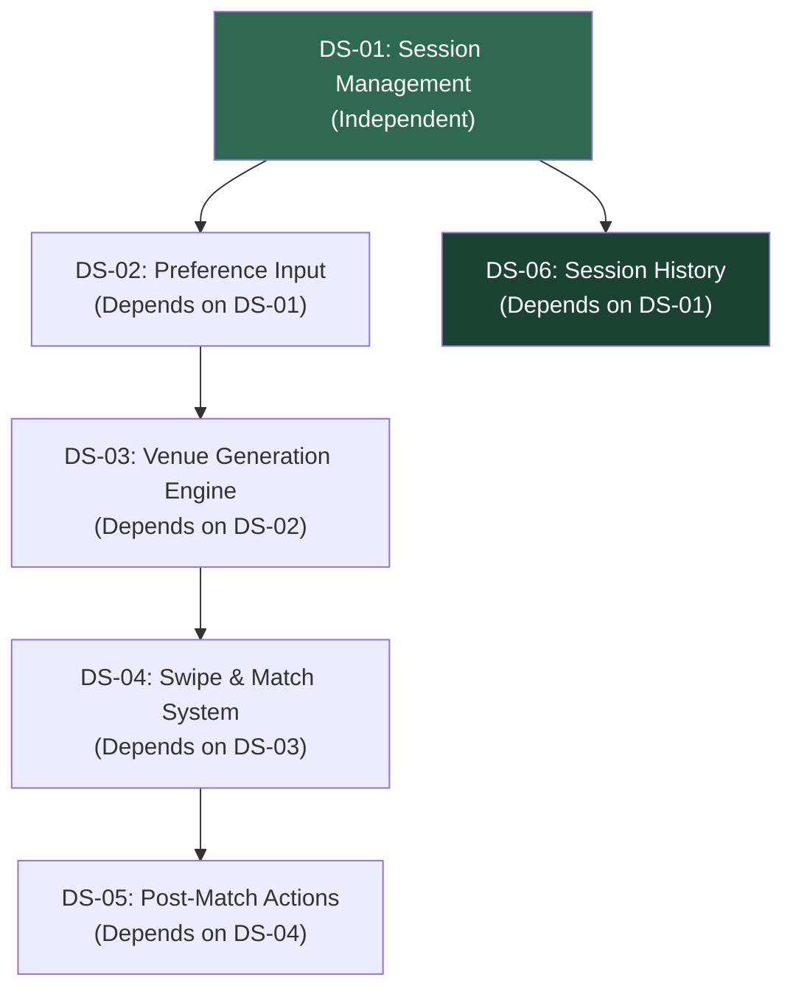
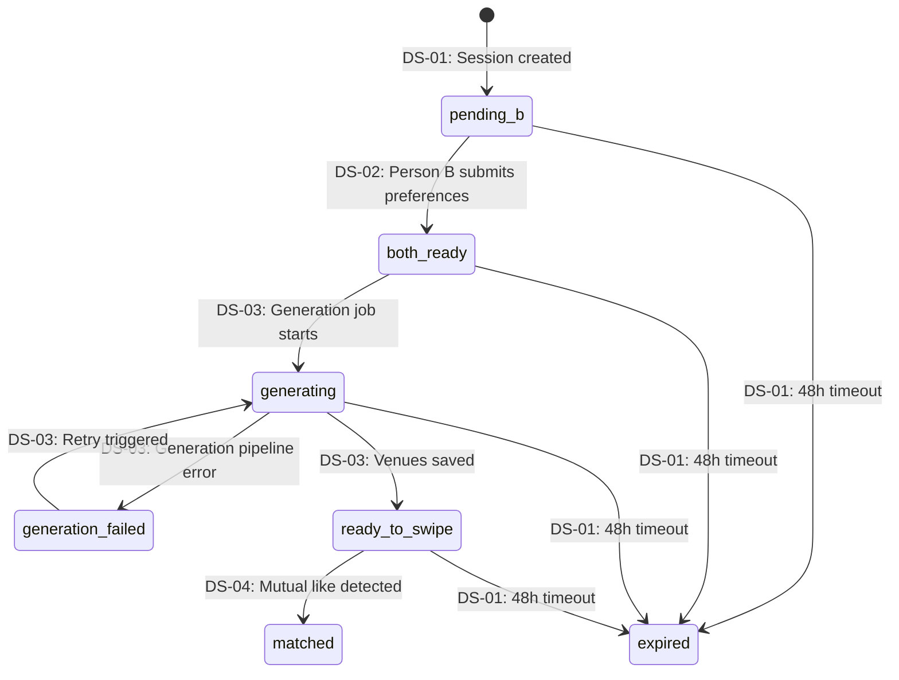

# Dateflow — Development Specifications Index

## Dependency Map

## Specifications

| ID | Name | Type | Depends On | User Stories |
|---|---|---|---|---|
| [DS-01](./ds-01-session-management.md) | Session Management | Independent | — | US-01, US-02, US-03 |
| [DS-02](./ds-02-preference-input.md) | Preference Input | Dependent | DS-01 | US-04, US-05, US-06 |
| [DS-03](./ds-03-venue-generation.md) | Venue Generation Engine | Dependent | DS-02 | US-07, US-12 |
| [DS-04](./ds-04-swipe-match.md) | Swipe & Match System | Dependent | DS-03 | US-10, US-11, US-13 |
| [DS-05](./ds-05-post-match-actions.md) | Post-Match Actions | Dependent | DS-04 | US-08, US-09 |
| [DS-06](./ds-06-session-history.md) | Session History | Dependent | DS-01 | US-14 |

## Global Class Registry

All 27 classes across all specs, tracked here to prevent cross-spec inconsistencies.

| Class | Spec | Type | Purpose |
|---|---|---|---|
| Session | DS-01 | Entity | Planning session between two people |
| SessionService | DS-01 | Service | Session lifecycle business logic |
| ShareLink | DS-01 | Value Object | Session invite link with expiry |
| ShareLinkService | DS-01 | Service | Link generation and validation |
| Preference | DS-02 | Entity | One user's inputs for a session |
| PreferenceService | DS-02 | Service | Preference submission and retrieval |
| Location | DS-02 | Value Object | Latitude/longitude coordinate pair |
| BudgetLevel | DS-02 | Enum | $, $$, $$$ |
| Category | DS-02 | Enum | restaurant, bar, activity, event |
| Venue | DS-03 | Entity | A venue candidate in a session |
| VenueScore | DS-03 | Value Object | Weighted scoring dimensions |
| VenueGenerationService | DS-03 | Service | Orchestrates generation pipeline |
| PlacesAPIClient | DS-03 | Client | Google Places API wrapper |
| AICurationService | DS-03 | Client | Claude API wrapper for venue curation |
| SafetyFilter | DS-03 | Filter | First-date safety venue filtering |
| MidpointCalculator | DS-03 | Utility | Geographic midpoint calculation |
| VenueCache | DS-03 | Cache | Redis cache for Places API results |
| Swipe | DS-04 | Entity | A user's like/pass decision on a venue |
| SwipeService | DS-04 | Service | Swipe recording and match orchestration |
| MatchDetector | DS-04 | Service | Atomic match detection via Postgres RPC |
| RoundManager | DS-04 | Service | Progressive round management (1-3) |
| MatchResult | DS-05 | Entity | Finalized match with venue details |
| DirectionsService | DS-05 | Service | Map deep link generation |
| CalendarExportService | DS-05 | Service | ICS calendar file generation |
| Account | DS-06 | Entity | Lightweight user account |
| AccountService | DS-06 | Service | Authentication and account management |
| SessionHistoryService | DS-06 | Service | Past session retrieval for a user |

## Global Session Status Machine

All statuses a session can hold, and which spec introduces each transition:

## Global API Endpoint Registry

| Method | Endpoint | Spec | Purpose |
|---|---|---|---|
| POST | `/api/sessions` | DS-01 | Create a new session |
| GET | `/api/sessions/[id]` | DS-01 | Retrieve session state |
| POST | `/api/sessions/[id]/preferences` | DS-02 | Submit preferences for a session |
| POST | `/api/sessions/[id]/generate` | DS-03 | Trigger venue generation (internal) |
| GET | `/api/sessions/[id]/venues` | DS-03 | Get venue shortlist for a session |
| POST | `/api/sessions/[id]/swipes` | DS-04 | Record a swipe decision |
| GET | `/api/sessions/[id]/status` | DS-04 | Poll session status (WebSocket fallback) |
| GET | `/api/sessions/[id]/result` | DS-05 | Get match result with venue details |
| GET | `/api/sessions/[id]/calendar` | DS-05 | Download ICS calendar file |
| POST | `/api/auth/register` | DS-06 | Create a lightweight account |
| POST | `/api/auth/login` | DS-06 | Authenticate and get session token |
| GET | `/api/sessions/history` | DS-06 | List past sessions for authenticated user |
