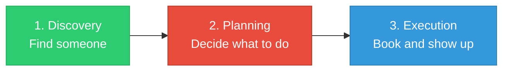
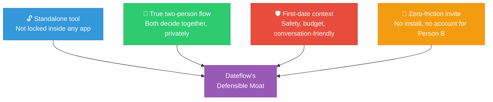

# Dateflow — Competitive Landscape

> **TL;DR:** Every major player owns the match phase or the booking phase. Nobody owns the planning phase in between. Dateflow is the only tool built from the ground up for two people deciding together, with no install required.

---

## The Problem Space

| Phase | Who owns it | Examples |
|-------|------------|---------|
| **Discovery** | Dating apps | Hinge, Bumble, Tinder |
| **Planning** | **Nobody** | This is the gap |
| **Execution** | Booking / venue platforms | OpenTable, Fever, Google Maps |

---

## Direct Competitors

| Competitor | What they do | Strengths | Weaknesses |
|-----------|-------------|-----------|-----------|
| **Cobble** | Tinder-style swipe matching on venue ideas | Two-person flow, raised $3M, 4.8 stars | iOS only, limited US cities, growth stalled post-2023 |
| **SoulPlan** | AI suggestions filtered by mood, budget, energy | Good personalization, calendar features | Aimed at couples, not first dates |
| **DateNight** | 3-6 venue ideas via Google Maps | Works in 200+ countries | Single-user only, no coordination, no booking |
| **Cupla** | Calendar sync + AI suggestions + venue map | Strong availability features | Marketed to couples, not first-daters |

---

## Adjacent Threats

| Threat | What they're doing | Why they're not Dateflow |
|--------|-------------------|------------------------|
| **Happn "Perfect Date"** (2025) | AI + Foursquare: 5 venue suggestions in chat | Locked inside Happn. No booking, no calendar, no two-person swipe. |
| **Hinge / Bumble** | AI conversation nudges, profile feedback | No venue or planning features as of 2026 |
| **Fever** | Best-in-class event discovery and ticketing | Not a planning tool — no coordination for first dates |
| **Google Maps "Ask Maps"** (2026) | AI conversational search for venues | No two-person flow, no coordination |
| **ChatGPT / Claude / Gemini** | Can generate date itineraries | No real-time availability, no booking, no two-person experience |

---

## Feature Gap Matrix

| Feature | Cobble | Happn | DateNight | Cupla | Fever | Google Maps | **Dateflow** |
|---|---|---|---|---|---|---|---|
| Location-aware venues | Yes | Yes | Yes | Yes | Yes | Yes | **Yes** |
| Two-person coordination | Yes | Partial | No | Yes | No | No | **Yes** |
| First-date focused | Yes | Yes | Yes | No | No | No | **Yes** |
| Booking integration | Yes | No | No | No | Yes | Partial | **Phase 2** |
| Calendar / scheduling | Yes | No | No | Yes | No | No | **Phase 2** |
| Works without dating app | Yes | No | Yes | Yes | Yes | Yes | **Yes** |
| No install required (web) | No | No | No | No | No | Yes | **Yes (MVP)** |
| Multi-category (food+events) | No | No | No | No | Events only | Partial | **Yes** |

---

## Dateflow's Defensible Position

