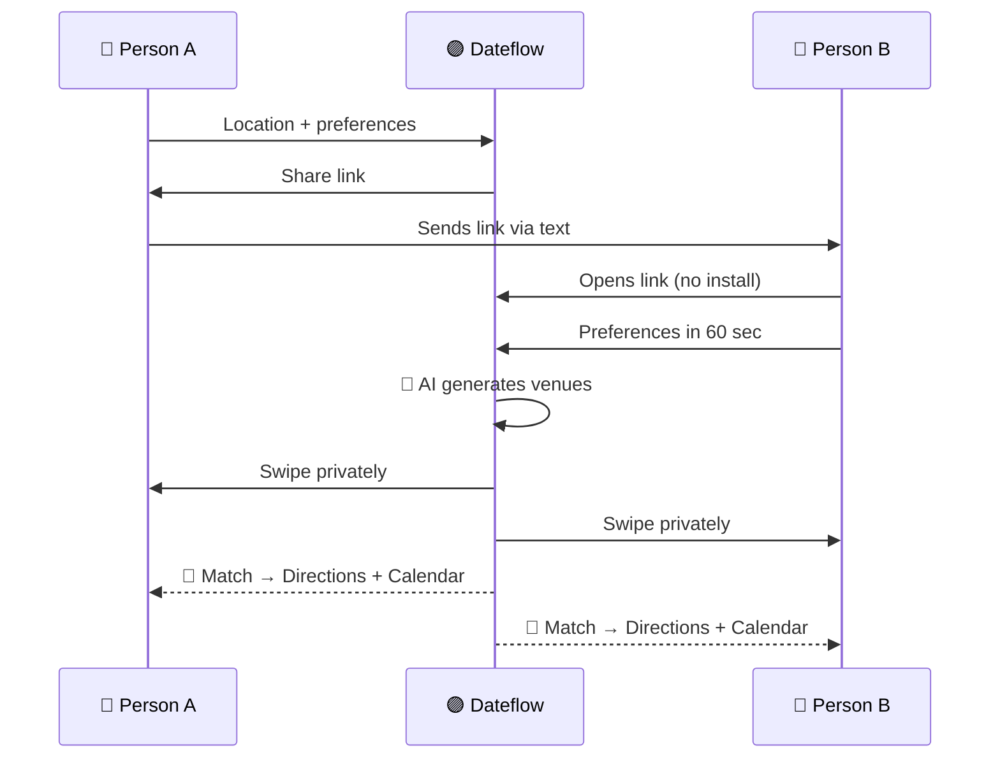
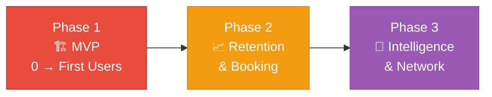
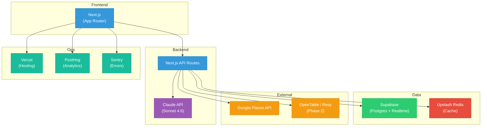
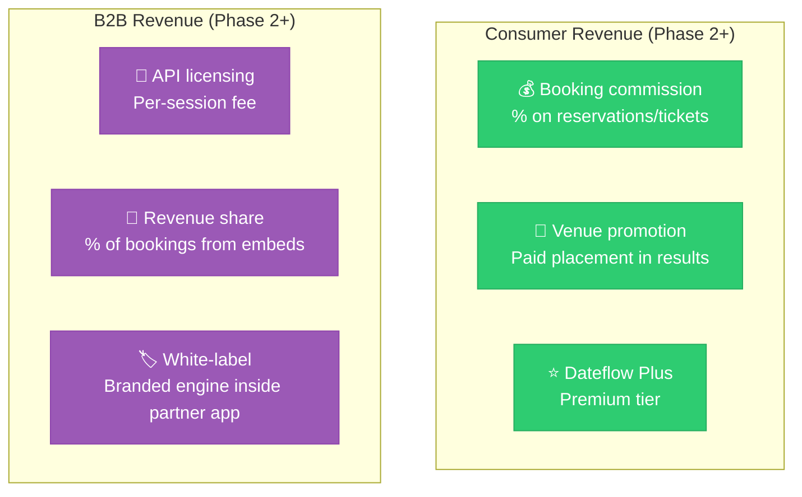

# Dateflow — Execution Plan

> **TL;DR:** Three phases — prove two people will use it (MVP), add booking and retention (Phase 2), add intelligence and partnerships (Phase 3). Launch in one city. The consumer demo is a sales tool for B2B deals.

---

## Core User Flow

---

## Phased Roadmap

---

### Phase 1 — MVP (0 to First Users)

**Goal:** Prove that two people will use a shared planning tool and agree on a venue.

| Build | Don't build (yet) |
|-------|------------------|
| Single-session planning flow (no account) | Booking / reservations |
| Location input (GPS or zip code) | Calendar integration |
| Category selection (restaurant, bar, activity, event, "surprise me") | User accounts / profiles |
| Budget filter ($ / $$ / $$$) | Notification system |
| AI-generated shortlist (5-8 options via Google Places) | Event supply (Fever/Eventbrite) |
| Private swipe interface | |
| Match reveal with venue details | |
| Share link (no app install required) | |
| Mobile-first web app | |

> **Success metric:** 50 completed session pairs within 60 days. *(Revised to 100 pairs at ≥55% match rate for B2B proof — see [pivot strategy](./pivot-b2b-strategy.md))*

---

### Phase 2 — Retention and Booking

**Goal:** Turn one-time users into repeat users. Add real utility with booking.

| Feature | Why it matters |
|---------|---------------|
| Lightweight accounts (email / Google sign-in) | Enables session history and returning users |
| Session history ("your past dateflows") | Avoid repeating venues, builds habit |
| OpenTable / Resy integration | "We agreed" → "we're booked" in one step |
| Eventbrite / Fever integration | Live events and experiences |
| "Tonight" mode | Same-day date planning |
| Time-of-day awareness | Don't show dinner spots for a 3pm date |
| Conversation-friendly tags | Noise level filtering |
| Midpoint calculation | Venues equidistant from both people |

> **Success metric:** 30% of sessions result in a booking through Dateflow.

---

### Phase 3 — Intelligence and Network

**Goal:** Make Dateflow smarter and stickier with personalization and social proof.

| Feature | Why it matters |
|---------|---------------|
| Preference learning | Gets better the more you use it |
| Post-date rating ("how did it go?") | Feeds recommendation quality |
| "Trending first date spots" by city | Crowdsourced from session data |
| Dating app deep link integration | B2B partnerships go live |
| Push notifications | Time-sensitive matches ("happy hour ends in 2hrs") |
| Native iOS + Android app | For retention-stage users |

---

## Tech Stack

| Layer | Choice | Reason |
|---|---|---|
| Frontend | Next.js (App Router) | Fast mobile web, easy share links, SSR |
| Backend | Next.js API routes | Unified stack, serverless auto-scaling |
| Database | Supabase (Postgres) | Auth + DB + realtime + pg_cron in one |
| Cache | Upstash Redis | Venue caching, rate limiting (serverless) |
| Job queue | Upstash QStash | Async venue generation with retries |
| AI | Claude API (Sonnet 4.6) | Venue curation, scoring, preference parsing |
| Venue data | Google Places API | Best coverage, ratings, photos, hours |
| Hosting | Vercel | Zero-config deploys, auto-scaling |
| Analytics | PostHog | Session funnels, drop-off analysis |
| Errors | Sentry | Error capture with session context |

---

## Go-to-Market Summary

See [strategy.md](./strategy.md) for the full rationale. Quick reference:

| Channel | One-line summary |
|---------|-----------------|
| **Creator content** | Seed mid-tier dating creators. Product demos in 30 seconds. |
| **Share link** | Person B's experience IS the ad. Every invite = potential new user. |
| **Communities** | Reddit/Discord — contribute authentically, mention when relevant. |
| **City-first** | Austin or Chicago. Venue depth > geographic breadth. |
| **Press** | Women's safety angle + "the feature dating apps won't build." |
| **B2B** | Thursday, The League, Coffee Meets Bagel. "We built the planning layer so you don't have to." |

---

## Monetization

> **B2B has better unit economics at scale.** One API deal with a mid-size dating app delivers more session volume than months of consumer marketing.
