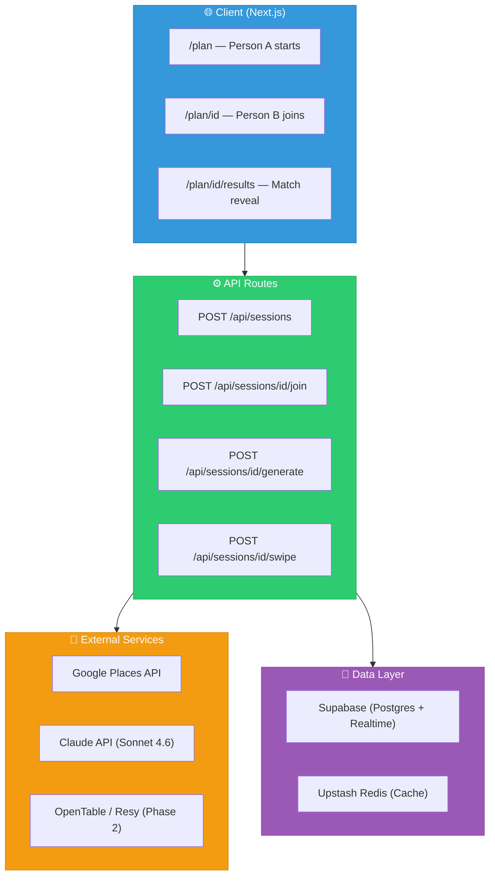
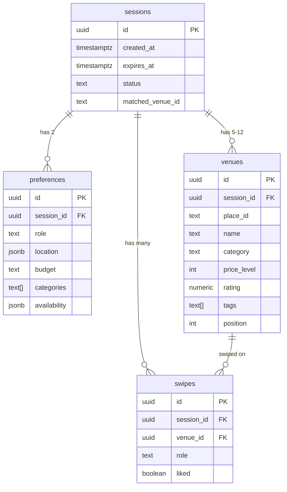
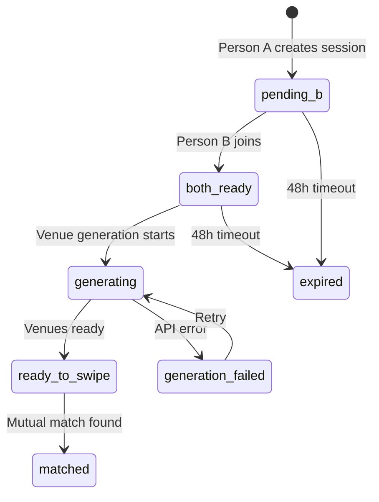
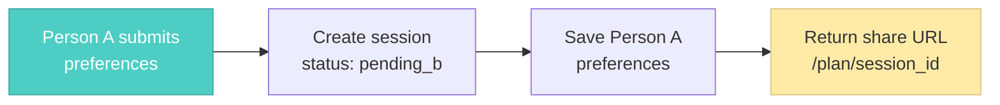
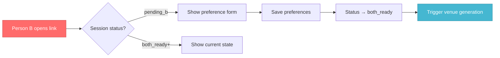
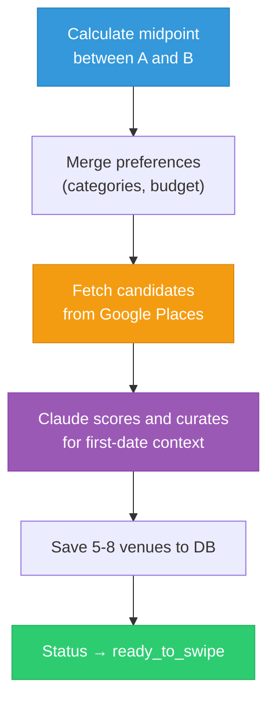
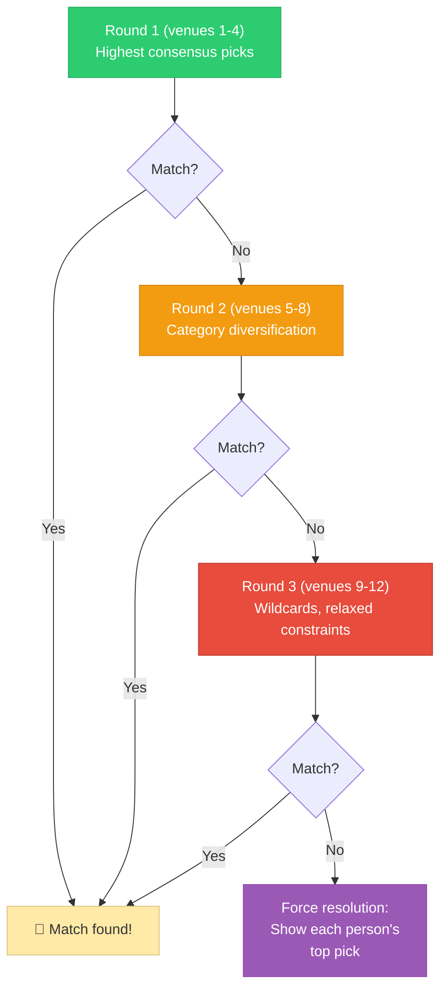
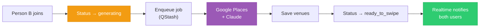

# Dateflow — Implementation Guide

> **TL;DR:** Mobile-first web app. No native app, no account required. Next.js + Supabase + Claude API. The core challenge is a two-person realtime session with atomic match detection.

---

## Architecture Overview



---

## Data Model (MVP)



**Session status flow:**



---

## Key Implementation Steps

### Step 1 — Project Setup

```bash
npx create-next-app@latest dateflow --typescript --tailwind --app
cd dateflow
npm install @supabase/supabase-js @supabase/ssr
npm install @anthropic-ai/sdk
npm install @googlemaps/google-maps-services-js
```

### Step 2 — Session Creation (Person A)

`POST /api/sessions`



### Step 3 — Session Join (Person B)

`POST /api/sessions/[id]/join`



### Step 4 — Venue Generation (AI + Places API)



```typescript
// Simplified generation flow
const midpoint = calculateMidpoint(prefA.location, prefB.location);
const mergedCategories = union(prefA.categories, prefB.categories);
const budget = min(prefA.budget, prefB.budget); // conservative

const candidates = await fetchNearbyPlaces({
  location: midpoint,
  radius: 2000,
  types: mergedCategories,
  maxPriceLevel: budgetToLevel(budget),
});

const shortlist = await curateWithAI(candidates, {
  preferences: { prefA, prefB },
  firstDateContext: true,
});
```

**Claude prompt guidance:**
- Favor conversation-friendly venues (not too loud, not too dark)
- Avoid commitment-heavy venues (no 2-hour tasting menus)
- Prefer easy exits (no valet-only, no ticketed entry for drinks)
- Surface variety: one restaurant, one bar, one activity if categories allow

### Step 5 — Swipe Interface and Match Algorithm

#### Progressive Rounds (Not Infinite Scroll)



#### Venue Scoring

```typescript
type VenueScore = {
  categoryOverlap: number;       // weight: 0.30
  distanceToMidpoint: number;    // weight: 0.25
  firstDateSuitability: number;  // weight: 0.25 (AI-scored)
  qualitySignal: number;         // weight: 0.15 (rating × log(reviews))
  timeOfDayFit: number;          // weight: 0.05
};
```

#### Atomic Match Detection

Both users see venues in the same order. Swipes are private. A Postgres stored procedure makes match detection atomic (prevents race conditions when both swipe within milliseconds):

```sql
CREATE OR REPLACE FUNCTION record_swipe_and_check_match(
  p_session_id uuid,
  p_venue_id   uuid,
  p_role       text,
  p_liked      boolean
) RETURNS jsonb AS $$
DECLARE
  v_other_liked boolean;
  v_matched     boolean := false;
BEGIN
  INSERT INTO swipes (session_id, venue_id, role, liked)
  VALUES (p_session_id, p_venue_id, p_role, p_liked)
  ON CONFLICT (session_id, venue_id, role) DO UPDATE SET liked = EXCLUDED.liked;

  IF p_liked THEN
    SELECT liked INTO v_other_liked
    FROM swipes
    WHERE session_id = p_session_id
      AND venue_id = p_venue_id
      AND role != p_role
    FOR UPDATE; -- row-level lock

    IF v_other_liked IS TRUE THEN
      UPDATE sessions
      SET status = 'matched', matched_venue_id = p_venue_id::text
      WHERE id = p_session_id AND status != 'matched';

      GET DIAGNOSTICS v_matched = ROW_COUNT;
      v_matched := v_matched > 0;
    END IF;
  END IF;

  RETURN jsonb_build_object('matched', v_matched, 'venue_id', p_venue_id);
END;
$$ LANGUAGE plpgsql;
```

#### Realtime Sync

Both users subscribe to session updates via Supabase Realtime. When status → `matched`, both redirect simultaneously:

```typescript
const channel = supabase
  .channel(`session:${sessionId}`)
  .on('postgres_changes', {
    event: 'UPDATE',
    schema: 'public',
    table: 'sessions',
    filter: `id=eq.${sessionId}`,
  }, (payload) => {
    if (payload.new.status === 'matched') {
      router.push(`/plan/${sessionId}/results`);
    }
  })
  .subscribe();
```

**Fallback:** If WebSocket drops, poll `GET /api/sessions/[id]/status` every 5 seconds. Page reload never loses progress.

### Step 6 — Match Reveal

`/plan/[id]/results` — Show the matched venue with:
- Name, photo, address, rating, tags
- **Get Directions** → deep link to Google Maps / Apple Maps
- **Save this date** → ICS calendar download (Phase 2)
- **Start over** → create a new session

---

## Distributed Systems Considerations

### Async Venue Generation



- Takes 2-5 seconds. Too slow for synchronous response → async job.
- Retry up to 3x with exponential backoff.
- If Claude unavailable → fall back to pure Places API ranking.
- 30-second timeout → `generation_failed` with "try again" option.

### Caching (Upstash Redis)

- **Cache key:** `places:{lat_2dp}:{lng_2dp}:{categories}:{price_level}`
- **TTL:** 6 hours
- **Hit:** Skip Places API call, run Claude on cached candidates (~1 sec)
- **Miss:** Call Places, cache results, proceed (~3-5 sec)

### Rate Limiting

| Endpoint | Limit | Why |
|----------|-------|-----|
| Session creation | 5 per IP per hour | Prevent abuse |
| Venue generation | 1 per session | Enforced by status guard |
| Swipe submission | 60 per user per minute | Prevent rapid-fire replay |

### Session Expiry

- Sessions expire after **48 hours**.
- Hourly cron job marks expired sessions.
- Hard-delete after 30 days (cascade to preferences, venues, swipes).

---

## Environment Variables

```bash
# .env.local
NEXT_PUBLIC_SUPABASE_URL=
NEXT_PUBLIC_SUPABASE_ANON_KEY=
SUPABASE_SERVICE_ROLE_KEY=

GOOGLE_PLACES_API_KEY=
ANTHROPIC_API_KEY=

NEXT_PUBLIC_APP_URL=http://localhost:3000
```

---

## Security

| Concern | How it's handled |
|---------|-----------------|
| Data retention | Sessions expire after 48h |
| PII | No names, email, or phone collected in MVP |
| Location data | Lat/lng only, not saved beyond session |
| API keys | All generation server-side, never exposed to client |
| Session IDs | UUIDs — not guessable |
| Abuse prevention | Rate limited per IP |

---

## Testing Strategy

| Type | What to test |
|------|-------------|
| **Unit** | Midpoint calculation, budget merging, AI prompt construction |
| **Integration** | Full session flow against real Supabase test instance |
| **E2E** | Two-browser Playwright test: Person A + Person B complete full flow |
