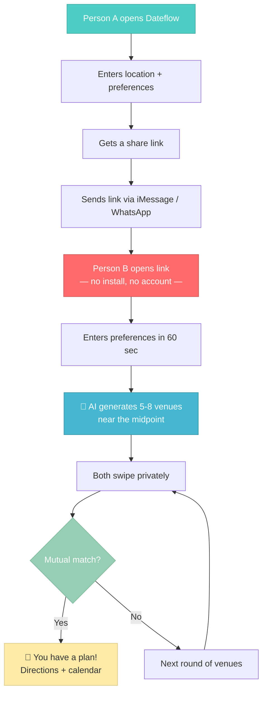
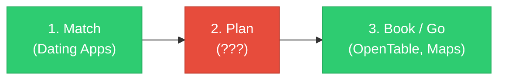

# Dateflow — Service Overview

> **TL;DR:** Dateflow is an AI-powered tool that helps two people go from "we should hang out" to "we have a plan" in under 2 minutes. It starts *after* the dating app match — where every other product stops.

---

## What Is Dateflow?

An AI-powered first date planning tool that turns the awkward "so what do you want to do?" moment into a smooth, coordinated experience.

Given two people's location, preferences, and availability, Dateflow produces a curated shortlist of nearby options — restaurants, bars, activities, events — that both people swipe on privately. First mutual match becomes the plan.

---

## The Goal

**Help two people who want to meet for the first time go from "we should hang out" to "we have a plan" in under two minutes.**

This is **not** a dating app. Dateflow starts *after* the match — it owns the planning layer that every dating app abandons.

---

## Why Does This Need to Exist?

Most date planning fails not because people lack ideas, but because of three friction points:

| Friction | What happens | How Dateflow fixes it |
|----------|-------------|----------------------|
| **Vulnerability** | Suggesting a place feels risky — "what if they hate it?" | Neither person suggests anything. Both react to a neutral list privately. |
| **Coordination** | Back-and-forth texting is slow and often fizzles out | One link, 60 seconds each, done. No texting loop. |
| **Overwhelm** | Infinite choices with zero context about the other person | AI narrows it to 5-8 options based on both people's inputs. |

### The Market Gap

> **Phase 2 is a complete vacuum.** Dating apps hand you off with nothing — no tools, no coordination. You fall back to texting. Often, the date never happens. **Dateflow owns Phase 2.**

---

## Where the Planning Conversation Actually Happens

By the time two people are close to meeting, they've almost always **left the dating app** and moved to iMessage, WhatsApp, or Instagram DMs.

This means:
- The share link lands in a **messaging app**, not inside a dating app
- The **link preview** (Open Graph tags) is Person B's actual first impression
- Person B clicks the link with **zero prior context** and higher skepticism
- The link preview and landing screen are **the core distribution mechanism**, not polish

---

## Who It's For

| Audience | Description |
|----------|------------|
| **Primary** | People actively dating (Hinge, Bumble, Tinder, or organically) who want a first date without planning friction |
| **Secondary** | Anyone in early-stage dating (first few dates) navigating the same uncertainty |

> **Key insight:** The user has a specific person in mind when they open Dateflow. This is not a "browse date ideas" tool. It's a **"I have a match and I want to make this happen"** tool.
