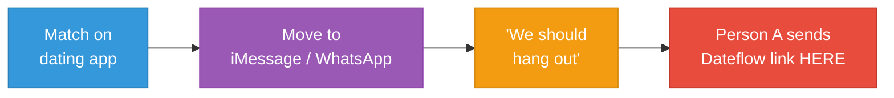
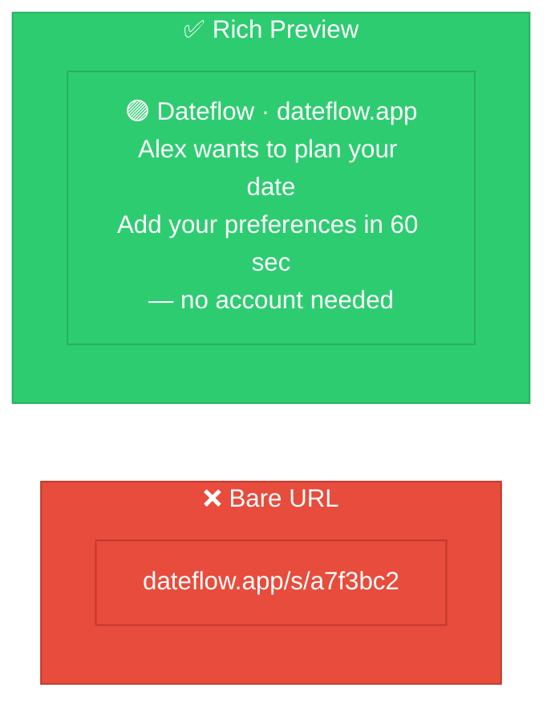
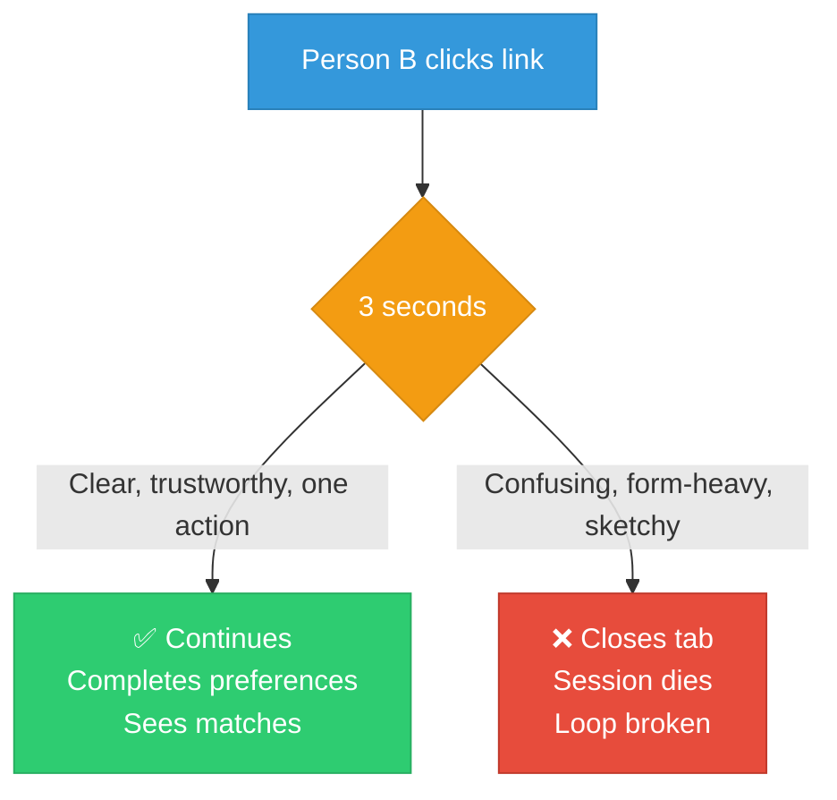
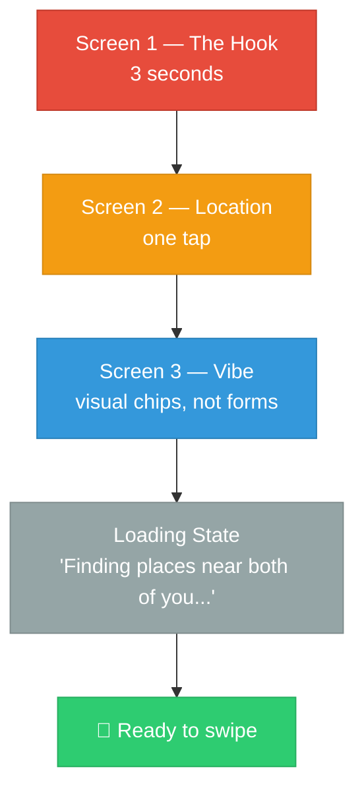
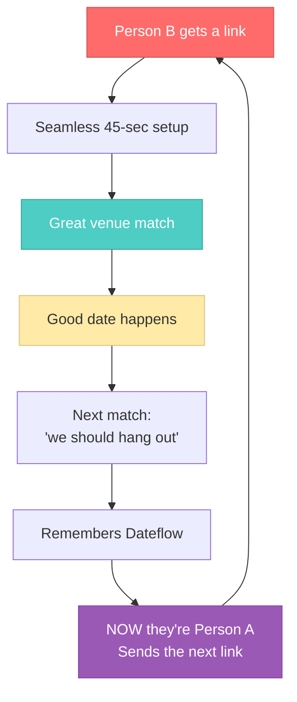

# Dateflow — Person B Experience: The Critical Gap

> **TL;DR:** Person B — who clicks a link from a near-stranger — decides in 3 seconds whether to continue or close the tab. Their landing screen has more leverage than any other screen in the product. If Person B bounces, the entire two-person mechanic is dead.

---

## The Missing Insight

By the time two people are close to meeting, they've left the dating app. The real conversation is in **iMessage, WhatsApp, or Instagram DMs.**

**Two consequences:**

| Reality | Impact |
|---------|--------|
| The B2B dating app embed solves for a **minority** of sessions | Most planning happens outside the dating app |
| The share link lands in a **messaging app** | The link preview IS Dateflow's first impression on Person B |

---

## The Rich Link Preview

A bare URL from a near-stranger looks like a phishing link. A rich preview looks like a real product.

### Platform Support

| Platform | Rich preview? |
|----------|:------------:|
| iMessage (iOS) | ✅ Full preview |
| WhatsApp | ✅ Full preview |
| Instagram DMs | ❌ Suppressed by Meta |
| Android Messages (RCS) | ⚠️ Varies |
| Snapchat | ❌ Not rendered |

> iMessage + WhatsApp cover the majority of the target audience. Instagram DMs are a platform risk worth monitoring.

---

## The 3-Second Rule

Person B clicks the link. **What happens in the next 3 seconds determines everything.**

### What Those 3 Seconds Must Communicate

| Question | Answer on screen |
|----------|-----------------|
| **What is this?** | One sentence: "Alex wants to plan your first date together." |
| **Why should I trust it?** | Clean design, no ads, Person A's name visible, no popup asking for email |
| **What do I do?** | One button. Not a form. **One button.** |

---

## Person A vs Person B: Different Experiences

| | Person A | Person B |
|---|---------|---------|
| **Context** | Initiated voluntarily, knows what Dateflow is | Clicked a link from a near-stranger |
| **Motivation** | High — wants the date to happen | Has motivation but also skepticism |
| **Tolerance** | Can handle a slightly longer setup | Will close the tab at any friction |
| **Design approach** | Standard preference flow | Maximum 3 screens, under 60 seconds |

---

## Proposed Person B Flow

**Screen 1 — The Hook** (3 seconds)
> "Alex wants to plan your first date."
>
> It takes 60 seconds. No account needed.
>
> **[ Add my preferences → ]**

Nothing else on this screen. No feature list. One button.

**Screen 2 — Location** (one tap)
> **[ Use my location ]** ← primary action, GPS auto-detect
>
> *or type a neighborhood / zip code*

**Screen 3 — Vibe** (visual, not a form)
> Category: `[ 🍽 Food ]` `[ 🍸 Drinks ]` `[ 🎯 Activity ]` `[ 🎲 Surprise me ]`
>
> Budget: `[ $ Casual ]` `[ $$ Mid-range ]` `[ $$$ Upscale ]`
>
> **[ Find our places → ]**

Visual chips, large tap targets, no dropdowns, no text input. Under 15 seconds.

**Total time: 30-45 seconds for Person B.**

---

## The Retention Flywheel

> **This loop is the growth engine.** If Person B bounces before completing preferences, the loop is dead. The Person B landing page is not UI polish — it is the most important page in the product.

---

## Priority Order

| Priority | Item | Impact |
|:--------:|------|--------|
| **1** | Person B landing screen design | Highest leverage in the entire product |
| **2** | Split DS-02 into Person A / Person B flows | Different UX for different context |
| **3** | Rich link preview (OG tags) | Small build, massive conversion impact |
| **4** | US-02a: Rich link preview user story | Add to active backlog |
| **5** | US-03 acceptance criteria update | Cover 3-second landing requirement |
| **6** | Update strategy.md Channel 2 | Reflect messaging app reality |
