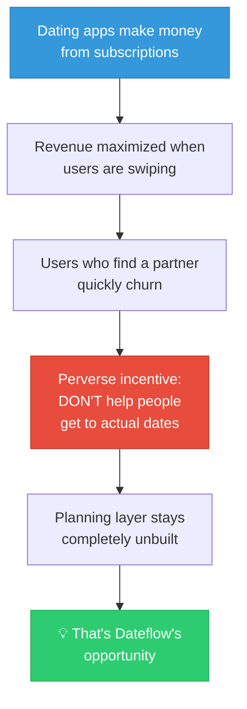
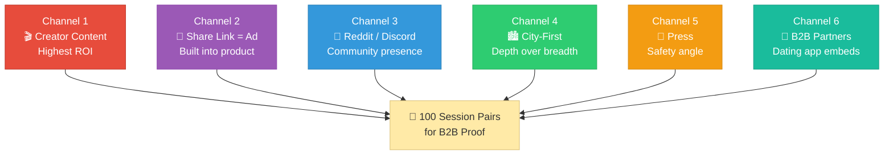
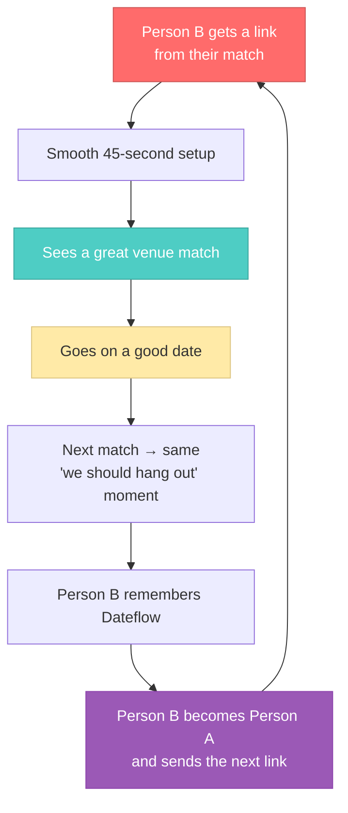
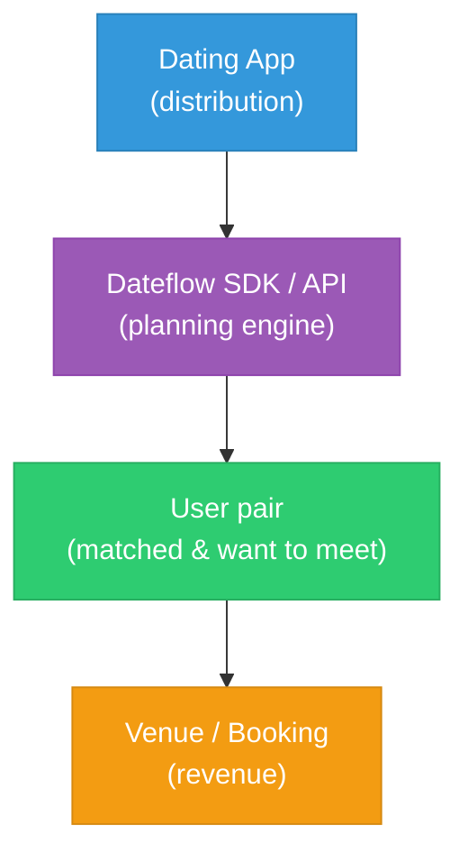
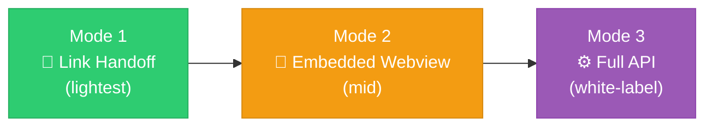

# Dateflow — Strategic Planning

> **TL;DR:** Launch focused exclusively on first dates (not couples). Market to people in the specific moment after they match. The share link IS the growth engine. Long-term play is B2B — selling the planning layer to dating apps as embeddable infrastructure.

---

## 1. First Dates Only at Launch

The two-person swipe mechanic works for couples too, but targeting both audiences at launch is a mistake.

| Reason | First-daters | Established couples |
|--------|-------------|-------------------|
| **UX needs** | Public, well-lit, easy exit, affordable, conversation-friendly | New experiences, romantic ambiance, higher budget |
| **Brand clarity** | "First date planner" — sharp, memorable, shareable | "Date planner for everyone" — vague, forgettable |
| **Viral loop** | Person B becomes Person A next time they have a match | Couples already have coordination mechanisms |

> **Decision:** MVP and Phase 2 = first dates only. Phase 3 = consider a "Date Night" mode with different defaults. Never turn couples away — just don't build for them yet.

---

## 2. Why This Service Is Genuinely Necessary

### The Planning Tax

A significant fraction of matches that express mutual interest in meeting **never actually meet.** It's not a motivation problem — both wanted to meet. It's a coordination failure.

> Dating apps have spent billions optimizing the match. Nobody has spent meaningfully on what happens next.

### The Vulnerability Problem

When you suggest "want to try that ramen place on 5th?" you're revealing your price range, your taste, your neighborhood, and your read on the other person. If they don't like it, you've been subtly rejected — not for who you are, but for your suggestion.

**Result:** Both people say "I'm down for whatever." Nobody picks. The date doesn't happen.

**Dateflow's fix:** Neither person suggests anything. Both react to a neutral third-party list privately. Choosing becomes low-stakes until a match reveals mutual agreement.

### Women's Safety

Women meeting strangers from dating apps need venues that are:

| Safety Factor | Why it matters |
|--------------|---------------|
| Public and well-lit | Not a private rooftop with one exit |
| Independently accessible | Not reliant on the other person for a ride |
| Not too intimate | A loud bar is actually safer than a quiet restaurant on date one |
| Easy to leave | No valet-only, no ticketed entry for casual drinks |

> No existing tool surfaces these considerations. **"First-date safe" as a default filter** is both the right thing to build and Dateflow's strongest differentiator.

### Dating Apps Won't Build This

---

## 3. Marketing Channels

### The Trigger Moment

Don't market to "people who want to go on dates." Market to a person in **this specific moment:** they just matched, exchanged numbers, and are staring at their phone wondering what to say next.

> **Tagline candidates:** "Stop texting. Start planning." · "You matched. Now what?" · "The part dating apps forgot."

### Channel Overview

### Channel Details

| Channel | Strategy | Key detail |
|---------|----------|-----------|
| **Creator content** | Seed 15-20 mid-tier dating creators (50K-500K followers) on TikTok/Reels. No paid deals — let them discover the utility. | The product is demonstrable in 30 seconds: "I sent my match this link and we had plans in 90 seconds" |
| **Share link as the ad** | Every invite sent IS a marketing impression on Person B. If their experience is magical, they become Person A next time. | The link preview (OG tags) must look trustworthy in iMessage/WhatsApp. Instagram DMs suppress previews — platform risk to monitor. |
| **Community presence** | Reddit: r/Tinder, r/hingeapp, r/dating_advice, r/datingoverthirty. Don't spam — contribute authentically. | Mention Dateflow only when someone literally describes the planning problem. |
| **City-first depth** | Launch in one city (Austin or Chicago). Curate top 150-200 venues manually. | "The app everyone in Austin uses" > "an app 10 people in 40 cities use" |
| **Press** | Lead with the women's safety angle. Secondary: "the feature dating apps won't build." | Targets: Refinery29, The Cut, TechCrunch, Global Dating Insights |
| **B2B partnerships** | Approach Thursday, The League, Coffee Meets Bagel at launch. | Position: "We built the planning layer so you don't have to." |

### The Growth Flywheel

> **This loop only fires if Person B completes their preferences.** Every % improvement in Person B's completion rate compounds directly into growth.

---

## 4. B2B — Dateflow as Embeddable Infrastructure

### The Core Insight

Dating apps know this gap exists. They've repeatedly failed to solve it because building a planning layer requires integrations (Google Places, OpenTable, realtime two-person sync) that are adjacent to their core competency. For Dateflow, it IS the core competency.

### How It Works

| For the dating app | For Dateflow |
|-------------------|-------------|
| Feature their users want, no engineering cost | Massive distribution, no marketing spend |
| Differentiator: "plan your date right from the app" | Credibility from established brands |
| Revenue share incentivizes promotion | Booking volume at scale |

### Who to Approach (and When)

| Tier | Targets | When | Why them |
|------|---------|------|----------|
| **Tier 1** | Thursday, The League, Coffee Meets Bagel | At launch | Small teams, fast decisions, philosophically aligned |
| **Tier 2** | Bumble, Hinge, Hily, Badoo | Phase 2 (after booking data) | Slower decisions, need proof first |
| **Avoid** | Tinder (Match Group) | Never first | 6-month procurement, will reverse-engineer it |

### Integration Modes

| Mode | How it works | Best for |
|------|-------------|----------|
| **Link Handoff** | Dating app sends deep link to Dateflow. User opens as separate web experience. | Quick pilot, lowest engineering effort |
| **Embedded Webview** | Dateflow UI renders inside the dating app's native webview. | Realistic first integration for mid-tier partner |
| **Full API / White-Label** | Dating app calls API, renders UI in their own design system. Dateflow is invisible. | Tier 2 partners who care about brand consistency |

### Risk and Upside

> **Risk:** A dating app embeds Dateflow, sees it working, and rebuilds in-house.
>
> **Managed by:** Moving fast (18 months ahead on venue depth + AI quality), exclusive early partnerships, and compounding session data moat. If a big app acquires Dateflow — that's a successful exit.
>
> **Upside:** One mid-size dating app embedding Dateflow could 10x session volume overnight. One B2B deal > years of consumer marketing.

---

## 5. Open Questions (Before Phase 2)

| Question | Current thinking |
|----------|-----------------|
| **When to introduce accounts?** | When users are clearly returning, not at launch |
| **B2B pricing model?** | Per-session fee — partners pay only when users are active |
| **City expansion trigger?** | 500 session pairs with >60% match rate + 3 organic press mentions |
| **Data ownership in B2B?** | Dateflow retains anonymized aggregate data; per-user data owned by dating app |
| **Couples mode timing?** | Revisit at Phase 3, not before |
