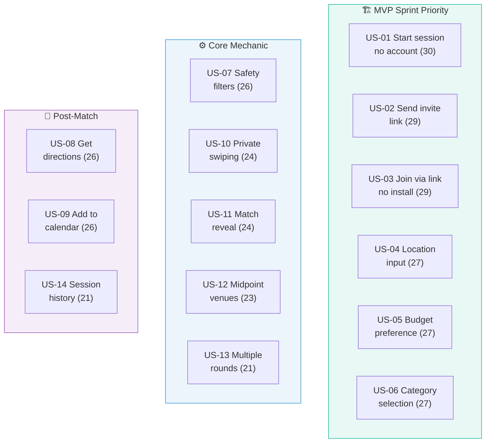

# Dateflow — User Stories

> **TL;DR:** 18 stories evaluated with INVEST scoring. Top 14 are in the active backlog. Bottom 4 deferred to later phases. Stories are ordered by priority — build from the top down.

---

## INVEST Framework

Each story scored 1-5 across six dimensions:

| I | N | V | E | S | T |
|---|---|---|---|---|---|
| Independent | Negotiable | Valuable | Estimable | Small | Testable |

**Max score: 30. Bottom 4 stories cut.**

---

## Active Backlog (14 Stories)

---

### US-01 — Start a session without an account `30/30` `Small`

**As** Person A, **I want** to start planning without creating an account **so that** I can use it immediately with zero commitment.

> **Why it matters:** A signup wall before delivering value kills conversion. Dateflow must be useful before it asks anything.

---

### US-02 — Send an invite link to a match `29/30` `Small`

**As** Person A, **I want** to share a link with my match **so that** they can join from any device without installing anything.

> **Why it matters:** This link is the entire acquisition flywheel. It lands in iMessage/WhatsApp — the preview IS Dateflow's first impression.

**Acceptance criteria:**
- Works immediately on mobile web
- Rich OG preview in iMessage/WhatsApp with Person A's name
- Copy-to-clipboard works on iOS and Android

---

### US-03 — Join a session via link `29/30` `Small`

**As** Person B, **I want** to join by opening a link **so that** I participate without downloading an app or creating an account.

> **Why it matters:** Person B is the most fragile conversion point. They clicked a link from a near-stranger. Any friction = abandonment.

**Acceptance criteria:**
- No install, no account, no email
- First screen communicates what + why + what to do in 3 seconds
- Max 3 screens, completable in under 60 seconds
- Fast load on mobile (SSR or skeleton UI)

---

### US-04 — Enter location `27/30` `Small`

**As** a first-dater, **I want** to enter my location or use GPS **so that** venue suggestions are actually near me.

> **Why it matters:** Location from both people powers the midpoint calculation. Without it, the shortlist is useless.

---

### US-05 — Set a budget preference `27/30` `Small`

**As** a first-dater, **I want** to set my budget range **so that** I'm never shown venues I can't afford.

> **Why it matters:** Budget misalignment is one of the most awkward first-date scenarios. Both budgets are collected privately, and Dateflow filters to the intersection.

---

### US-06 — Select activity categories `27/30` `Small`

**As** a first-dater, **I want** to choose what I'm open to (food, drinks, activity, "surprise me") **so that** suggestions match what I want to do.

> **Why it matters:** Categories shape the recommendation pool. "Surprise me" expands the search rather than picking randomly.

---

### US-07 — Venues filtered for safety `26/30` `Medium`

**As** a woman on a first date with someone from an app, **I want** safety-filtered venues (public, well-lit, easy to leave) **so that** I feel safe meeting a stranger.

> **Why it matters:** The most underserved concern in date planning and Dateflow's strongest differentiator. Women will share this feature with other women.

---

### US-08 — Get directions `26/30` `Small`

**As** a first-dater, **I want** to open directions to the venue from the results page **so that** I can navigate there without searching manually.

> **Why it matters:** If the match moment ends with "now go Google it," momentum dies. One tap to Maps keeps the energy alive.

---

### US-09 — Add to calendar `26/30` `Small`

**As** a first-dater, **I want** to save the plan to my calendar **so that** I don't forget it after leaving the app.

> **Why it matters:** A match that isn't in a calendar is a match that gets forgotten. Calendar = commitment.

---

### US-10 — Private swiping `24/30` `Medium`

**As** a first-dater, **I want** to swipe without my match seeing my choices until we agree **so that** I can be honest without social pressure.

> **Why it matters:** Private swipes prevent anchoring and performative positivity. Honest inputs = better matches.

---

### US-11 — Match reveal `24/30` `Medium`

**As** a first-dater, **I want** a satisfying reveal when we both like the same venue **so that** the plan feels exciting and confirmed.

> **Why it matters:** The peak emotional moment. Like Tinder's "It's a Match!" but for a concrete plan. Make it screenshot-worthy.

---

### US-12 — Equidistant venues `23/30` `Medium`

**As** a first-dater, **I want** venues roughly equidistant from both of us **so that** neither person travels significantly more.

> **Why it matters:** Travel fairness signals mutual consideration. Prevents subtle power imbalance before the date starts.

---

### US-13 — Multiple rounds `21/30` `Medium`

**As** a first-dater, **I want** new venue options if the first round has no match **so that** we never hit a dead end.

> **Why it matters:** "No match found" is the worst UX for a product whose job is producing a plan. Three rounds (4+4+4) always give a path forward.

---

### US-14 — Session history `21/30` `Medium`

**As** a returning user, **I want** to see past sessions **so that** I avoid repeating the same venues.

> **Why it matters:** Retention feature for Phase 2. Requires accounts. Deferred from MVP but stays in backlog.

---

## Deferred Stories (Bottom 4)

| ID | Story | Size | Score | Why deferred |
|----|-------|------|-------|-------------|
| US-15 | Rate how the date went | M | 21 | Requires accounts + re-engagement loop. Phase 3. |
| US-16 | Time-of-day appropriate suggestions | M | 20 | Polish, not a standalone value driver. |
| US-17 | Dating app API integration | XL | 20 | Strategically huge but not estimable at MVP stage. Phase 2. |
| US-18 | Book a reservation from match | L | 18 | External API dependencies (OpenTable/Resy). Phase 2. |

---

## Rankings at a Glance

| Rank | ID | Story | Size | Score |
|:----:|-----|-------|:----:|:-----:|
| 1 | US-01 | Start session, no account | S | **30** |
| 2 | US-02 | Send invite link | S | **29** |
| 3 | US-03 | Join via link, no install | S | **29** |
| 4 | US-04 | Enter location | S | **27** |
| 5 | US-05 | Set budget | S | **27** |
| 6 | US-06 | Select categories | S | **27** |
| 7 | US-07 | Safety-filtered venues | M | **26** |
| 8 | US-08 | Get directions | S | **26** |
| 9 | US-09 | Add to calendar | S | **26** |
| 10 | US-10 | Private swiping | M | **24** |
| 11 | US-11 | Match reveal | M | **24** |
| 12 | US-12 | Equidistant venues | M | **23** |
| 13 | US-13 | Multiple rounds | M | **21** |
| 14 | US-14 | Session history | M | **21** |
| ~~15~~ | ~~US-15~~ | ~~Post-date rating~~ | ~~M~~ | ~~21~~ |
| ~~16~~ | ~~US-16~~ | ~~Time-of-day filtering~~ | ~~M~~ | ~~20~~ |
| ~~17~~ | ~~US-17~~ | ~~Dating app API~~ | ~~XL~~ | ~~20~~ |
| ~~18~~ | ~~US-18~~ | ~~Booking integration~~ | ~~L~~ | ~~18~~ |
